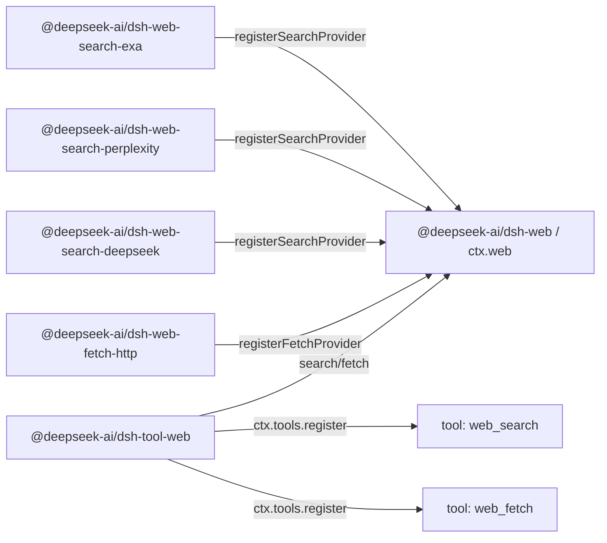

# Agent Note: Web capability seam — stabile tools über mehrere provider hinweg

Status: implemented

[English](2026-06-24-web-capability-seam.md) | [中文](2026-06-24-web-capability-seam.zh.md) | Deutsch

## Problem

Der harness benötigt model-facing web tools, ohne den model contract an die API-Form eines einzelnen Anbieters zu binden. Search ist der unmittelbare Druckpunkt: Von Anfang an sowohl Exa search als auch Perplexity search zu unterstützen — zwei bewusst unterschiedliche provider-shapes (Exa liefert ein flaches `results[]` aus `{title, url, highlights, publishedDate}`; Perplexity liefert eine generierte Antwort plus Zitate) — beweist, dass der normalisierte web contract nicht nur einen einzelnen Anbieter spiegelt. Fetch ist eine separate Operation: Ein anonymes öffentliches HTTP(S)-fetch-backend hat Transport-, Sicherheits-, Redirect-, Decoding- und Größenlimits-Bedenken, die nicht dieselben sind wie provider-gestützte search.

Die model-facing API muss stabil bleiben, während backends sich ändern. Ein search-provider-Wechsel sollte nicht ändern, wie das model eine query anfragt, und ein fetch-Implementierungswechsel sollte nicht ändern, wie das model eine URL anfragt. Umgekehrt sollte ein provider-paket nicht seine eigene model-facing tool schema nur deshalb exponieren, weil es zusätzliche provider-spezifische Knöpfe hat.

Search und fetch direkt in `dsh-tool-web` zu legen, würde das model-facing tool gleichzeitig provider-Auswahl, backend-request-Mapping, Transport-Policy, Ergebnis-Normalisierung, prompt-Leitlinie, Präsentation und schema-Registrierung besitzen lassen. Die umgekehrte Problematik entsteht, wenn jeder provider sein eigenes tool registriert: tool-Verfügbarkeit, Namen, Beschreibungen und Parameter hingen davon ab, welche provider-pakete zufällig geladen werden, und provider-spezifische Felder würden in den model contract lecken.

Es gibt auch eine provider-Auswahl-Frage. Bestehende `tool-bash` und `tool-fs` können sich auf Cordis `inject` verlassen, weil es einen einzigen backend-service-key gibt. Web hat zwei unabhängige capabilities (`search` und `fetch`) und potenziell mehrere provider pro capability. `inject: ['web']` beweist, dass die seam existiert; es beweist nicht, dass ein nutzbare search- oder fetch-provider existiert, und es definiert nicht, welcher provider gewinnen soll, wenn mehrere registriert sind.

## Entscheidung

Web-Zugriff ist eine first-class capability seam, die [die capability-seam Agent Note](2026-06-13-capability-seams.de.md) folgt:

1. `@deepseek-ai/dsh-web` (`packages/web/web`) besitzt `ctx.web`, provider-Registrierung, provider-Auswahl, geteilte request/result-Vokabularien und web-spezifische Fehler.
2. Provider-pakete implementieren konkrete backends und registrieren capabilities bei `ctx.web`, beispielsweise `@deepseek-ai/dsh-web-search-exa`, `@deepseek-ai/dsh-web-search-perplexity`, `@deepseek-ai/dsh-web-search-deepseek` und `@deepseek-ai/dsh-web-fetch-http`.
3. `@deepseek-ai/dsh-tool-web` (`packages/web/tool-web`) besitzt die model-facing `web_search` und `web_fetch` tool schemas, prompt-Abschnitte, Argument-Validierung, Ergebnis-Formatierung und tool-eigene Präsentation über `ctx.web`.

Provider registrieren keine tools. Provider registrieren capabilities. `dsh-tool-web` ist der einzige Besitzer der model-facing Namen, Beschreibungen, prompt-Leitlinien, JSON schemas und Präsentationen.

Search und fetch sind separate tools, aber eine einzige web-zugriff-seam. `ctx.web` besitzt provider-Auswahl, abort/error-Vokabular und deployment-Konfiguration für beide parallelen registries. Ihre request schemas und provider-Logik bleiben getrennt; der geteilte service ist die produkthafte Grenze für den Web-Zugriff.

`dsh-tool-web` registriert model-facing web tools, wenn das Produkt diese tools aktiviert hat und die `ctx.web`-seam vorhanden ist. Backend-Verfügbarkeit ist eine Executions-Time-Angelegenheit, keine schema-Registrierungs-Angelegenheit:

- `web_search` wird registriert, wenn web search für das Produkt/app aktiviert ist, `web_fetch` wenn web fetch aktiviert ist.
- Ein tool wird nie einfach deshalb deregistriert, weil sein ausgewählter provider fehlt, falsch konfiguriert ist, Credentials fehlt, mehrdeutig ist oder vorübergehend nicht verfügbar ist.
- Der provider wird zur Executions-Time aufgelöst, und ein strukturierter `WebError` wird zurückgegeben, wenn die ausgewählte capability nicht ausgeführt werden kann.

Dies hält das model schema stabil, ohne plugin-Ladereihenfolge, Credential-State oder HMR-Timing zum Teil des model-facing contract zu machen. Wenn web search aktiviert ist, aber kein nutzbare search-provider existiert, bleibt `web_search` sichtbar und die Ausführung schlägt mit einem strukturierten `WebError` wie `WEB_PROVIDER_UNAVAILABLE` oder `WEB_PROVIDER_CONFIGURED_UNAVAILABLE` fehl. Wenn ein provider nach `dsh-tool-web` erscheint, kann die nächste Ausführung ihn verwenden, ohne das schema zu ändern. Wenn ein provider während des Aufrufs verschwindet, schlägt die Ausführung mit einem strukturierten `WebError` fehl, statt einen anderen provider still zu wählen oder auf `UNKNOWN_TOOL` durchzufallen.

Die seam exponiert bewusst keine observation-Oberfläche — kein registry-change-event und keine aggregierte capability-status-Abfrage. Nichtverfügbarkeit ist eine Tatsache, die ein caller durch Ausführung beobachtet: `search()`/`fetch()` lösen den provider zur Aufrufzeit auf und werfen den strukturierten `WebError`, der benennt, was fehlgeschlagen ist. [Die observation-surface Agent Note](../../archived/simplification/2026-07-04-drop-unconsumed-web-observation-surface.md) hält dieses Urteil fest: On-call-ableitungselektion und enablement-basierte Registrierung lassen keinen consumer zurück, der ein Change-Signal oder eine Verfügbarkeitsprüfung braucht, die sich von Ausführung und Fehler-Routing unterscheidet, und ein zukünftiger provider-status-Panel führt das kleinste Signal oder die Abfrage ein, die er tatsächlich konsumiert.

## Paket-Topologie

Die drei-Paket-Service Definition / Service Provider / Consumer-Aufteilung folgt bash und filesystem, aber das *interface*-Paket liegt näher an der LLM-seam. `LlmRuntime` (`packages/llm/llm/src/index.ts`) ist ein name-keyed provider-registry: `registerAdapter(models, adapter)` speichert adapter in einer `Map`, gibt einen disposer zurück, wirft `DUPLICATE_ADAPTER` bei doppelten keys und wirft `NO_ADAPTER` zur Auflösungszeit. `ctx.web` folgt dieser registry-Form, hat aber zwei capability-arten und eine reichere Auswahl-Policy (ein konfiguriertes provider-id oder Auto-Auswahl, wenn genau ein nutzbare provider registriert ist), sodass der `WebError`, den eine Ausführung wirft, erklären kann, warum eine search- oder fetch-capability nicht ausgeführt werden kann.

Die Abhängigkeitsrichtung spiegelt bash und filesystem:

```text
@deepseek-ai/dsh-tool-web  --depends on-->  @deepseek-ai/dsh-web  <--depends on--  @deepseek-ai/dsh-web-search-exa
        consumer                                 interface                       implementation
                                                                  <--depends on--  @deepseek-ai/dsh-web-search-perplexity
                                                                                   implementation
                                                                  <--depends on--  @deepseek-ai/dsh-web-search-deepseek
                                                                                   implementation
                                                                  <--depends on--  @deepseek-ai/dsh-web-fetch-http
                                                                                   implementation
```

Zur Laufzeit registrieren provider-pakete capabilities bei `ctx.web`; `tool-web` registriert stabile tools bei `ctx.tools` und führt sie durch die seam aus:



`@deepseek-ai/dsh-web` hängt nur von Cordis und niedrigen harness-Unterstützungen ab. Es deklariert `ctx.web`, provider-interfaces, request/result-Types, den provider-Verfügbarkeits-contract und Fehlercodes. Es importiert keine tool-, agent-, session-, LLM- oder provider-pakete.

Provider-pakete hängen nur von `dsh-web` und Cordis ab. Sie besitzen Credentials, Endpunkte, wire-Mapping, Parsing und `WebError`-Umwandlung, und verwenden platform `fetch`. Jeder provider injiziert den geteilten service und registriert ein backend; nur `dsh-web` besitzt den `ctx.web`-key. Provider-private Protokoll-shapes erzeugen keine Abhängigkeiten zu `ctx.llm` oder einem Cordis-HTTP-service.

`@deepseek-ai/dsh-tool-web` hängt von `@deepseek-ai/dsh-web`, `@deepseek-ai/dsh-tools`, `@deepseek-ai/dsh-system-prompt` und Cordis ab. Es importiert nie konkrete provider-pakete.

## `ctx.web` contract

`ctx.web` ist eine provider-registry plus eine provider-auswählende Executions-API. Die registry-Hälfte bleibt nah an `LlmRuntime`: eine `Map<id, provider>` pro capability-art, `registerSearchProvider` / `registerFetchProvider`-Methoden, die disposer zurückgeben, doppelte ids, die `WebError` werfen, und Executions-Time-Auflösung, die wirft, wenn der ausgewählte provider fehlt oder unbrauchbar ist. Die autoritativen Signaturen leben in `packages/web/web/src/types.ts`; die Form der seam:

```ts
import type { WebFetchRequest, WebFetchResult, WebSearchRequest, WebSearchResult } from '@deepseek-ai/dsh-web'

interface WebSearchProvider {
  readonly id: string
  available(): boolean
  search(request: WebSearchRequest, signal?: AbortSignal): Promise<WebSearchResult>
}

interface WebFetchProvider {
  readonly id: string
  available(): boolean
  fetch(request: WebFetchRequest, signal?: AbortSignal): Promise<WebFetchResult>
}

interface WebRuntime {
  registerSearchProvider(provider: WebSearchProvider): () => void
  registerFetchProvider(provider: WebFetchProvider): () => void

  search(request: WebSearchRequest, signal?: AbortSignal): Promise<WebSearchResult>
  fetch(request: WebFetchRequest, signal?: AbortSignal): Promise<WebFetchResult>
}
```

Das optionale signal ist Executions-Steuerung, kein Business-Input: `tool-web` überreicht `exec.signal` direkt, sodass turn-Abbruch, tool-timeout und agent-disposal die provider-Netzwerk-Anfragen, stream-reader und teures Decoding erreichen. Die seam überreicht kein `ToolExecution` — das würde `dsh-web` von `dsh-tools` abhängig machen.

Provider-ids sind stabile Strings und eindeutig innerhalb ihrer capability-art. Die Registrierung eines doppelten search-provider-ids oder doppelten fetch-provider-ids schlägt fehl, statt den alten provider still zu ersetzen. Provider-Registrierung gibt einen disposer zurück und folgt dem bestehenden `ctx.tools.register()` / `ctx.systemPrompt.section()`-Muster: die Mutation ist in `ctx.effect()`Wrapped, sodass die Registrierung mit der beitragenden fiber abgerissen wird.

## Provider-Verfügbarkeit und -Auswahl

Provider-Verfügbarkeit und capability-Auswahl sind separate Konzepte, aber beide bleiben minimal. Ein provider berichtet nur, ob seine konkrete Implementierung durch günstige lokale Checks wie Credential-Präsenz oder parsebare Endpunkt-Konfiguration nutzbar ist. Ein provider `available()` darf keine Netzwerk-Aufrufe tätigen.

`LlmRuntime` hat gar keinen status-Types: Verfügbarkeit wird als registry-Beitrittsstatus plus Auflösungszeit-Wurf ausgedrückt. `ctx.web` folgt derselben Disziplin. Die seam exponiert keine aggregierte capability-status-Abfrage — `search()` / `fetch()` leiten die Auswahl bei jedem Aufruf aus dem konfigurierten provider-id, den registrierten providern und dem günstigen lokalen `available()`-Boolean jedes providers ab, und ein Auswahl-Fehler ist der zur Executions-Time geworfene strukturierte `WebError`. Ein caller, der wissen muss, ob eine capability ausgeführt werden kann, führt aus und routet diesen Fehler; nichts wird als mutabler service-State gespeichert.

Das Boolean ist ein Input für die Auswahl, kein Health-System. `tool-web` ruft nie direkt `available()` eines providers auf — sein einziger Pfad in die seam ist `search()` / `fetch()` — sodass die Auswahl-Policy einen einzigen Besitzer hat.

Die Auswahl darf nicht von der Registrierungsortung abhängen. Cordis-Ladereihenfolge, Konfigurationsreihenfolge und HMR-Timing sind keine Produkt-Semantik.

| Situation | Ausführungsverhalten |
|---|---|
| Ein konfiguriertes provider-id ist registriert und `available() === true` | führt diesen provider aus |
| Ein konfiguriertes provider-id ist nicht registriert | schlägt mit `WEB_PROVIDER_CONFIGURED_MISSING` fehl |
| Ein konfiguriertes provider-id ist registriert, aber nicht verfügbar | schlägt mit `WEB_PROVIDER_CONFIGURED_UNAVAILABLE` fehl |
| Kein provider-id ist konfiguriert und genau ein provider für diese art ist registriert und verfügbar | führt diesen einzelnen provider aus |
| Kein provider-id ist konfiguriert und kein provider für diese art ist registriert | schlägt mit `WEB_PROVIDER_UNAVAILABLE` fehl |
| Kein provider-id ist konfiguriert und mehrere nutzbare provider für diese art sind registriert | schlägt mit `WEB_PROVIDER_AMBIGUOUS` fehl, statt nach Registrierungsortung zu wählen |
| Kein provider-id ist konfiguriert und provider existieren, aber keiner ist nutzbar | schlägt mit `WEB_PROVIDER_UNAVAILABLE` fehl |

Die „einzelner provider wird automatisch ausgewählt"-Regel ist für Tests, Demos und einfache Deployments gedacht. Produkt-Konfigurationen setzen explizite provider-ids:

```yaml
- id: web
  name: '@deepseek-ai/dsh-web'
  config:
    searchProvider: exa
    fetchProvider: http

- id: web-search-exa
  name: '@deepseek-ai/dsh-web-search-exa'

- id: web-search-perplexity
  name: '@deepseek-ai/dsh-web-search-perplexity'

- id: web-search-deepseek
  name: '@deepseek-ai/dsh-web-search-deepseek'

- id: web-fetch-http
  name: '@deepseek-ai/dsh-web-fetch-http'

- id: tool-web
  name: '@deepseek-ai/dsh-tool-web'
```

Operative Overrides speisen denselben expliziten Auswahl-Pfad: `DSH_WEB_SEARCH_PROVIDER=perplexity` ist äquivalent zu config `searchProvider: perplexity`, keine versteckte Prioritätskette innerhalb von `dsh-tool-web`.

`ctx.web.search()` und `ctx.web.fetch()` lösen den provider zur Executions-Time unter Verwendung der obigen Auswahlregeln auf. Wenn die ausgewählte capability nicht verfügbar ist, werfen sie `WebError` mit einem strukturierten code wie `WEB_PROVIDER_UNAVAILABLE`, `WEB_PROVIDER_CONFIGURED_MISSING`, `WEB_PROVIDER_CONFIGURED_UNAVAILABLE` oder `WEB_PROVIDER_AMBIGUOUS`. Wenn kein provider explizit konfiguriert ist und kein nutzbare provider existiert, ist der Ausführungsfehler der generische `WEB_PROVIDER_UNAVAILABLE`-Fall; es gibt bewusst keine diagnostische Zusammenfassung jedes nicht verfügbaren providers.

## Search request und result schema

Das `web_search` model-facing tool ist klein. Das einzige model-facing Argument ist:

- `query`: obligatorische string.

`max_results` wird NICHT dem model exponiert. Es ist eine `dsh-tool-web`-Layer-Entscheidung: Das tool setzt das Ergebnis-Limit — die `searchMaxResults` plugin config, Standard `8` (ausgerichtet auf OpenCodes Exa-Standard), im Spiegel von `dsh-tool-fs`'s `readLimit` — und übergibt es an die seam als `maxResults` auf `WebSearchRequest`. Es vom model schema fernzuhalten, bedeutet, dass das model nur eine Frage stellt und das Produkt steuert, wie viel Kontext zurückkommt; das Feld kann später zu einem model-facing Argument befördert werden, ohne die seam zu brechen.

`maxResults` fließt tool → seam → provider, und das Limit wird auf dem Rückweg erzwungen:

- `dsh-tool-web` besitzt den Wert und legt ihn auf `WebSearchRequest.maxResults`.
- `ctx.web` übergibt die request unverändert an den ausgewählten provider.
- Ein provider wendet `maxResults` auf der request-Ebene an, wenn seine API es unterstützt (Exas `numResults`), als Kosten/Latenz-Optimierung.
- `ctx.web` erzwingt das Limit auf dem result: Wenn ein provider mehr als `maxResults` sources zurückgibt — weil seine API keine Ergebnisanzahl-Steuerung hat (Perplexity) oder den Hinweis ignoriert — kürzt die seam `sources[]` auf `maxResults` und setzt `WebSearchResult.truncated` auf `true`, bevor sie zurückgibt. Dies macht das Limit zu einer einzigen cross-provider-Garantie, auf die sich die model-facing-Schicht verlassen kann, statt etwas, woran sich jeder provider daran erinnern muss, es zu befolgen.

Die seam request trägt keine provider-spezifischen Steuerungen — keine Perplexity-model-Auswahl, search-Frische, Domain-Filter, Exa `livecrawl`, Exa `type`, regionale Hinweise, generierte-Antwort-Budgets oder search-Tiefe. Ein solches Feld wird nur hinzugefügt, wenn es provider-neutrale Semantik hat, die sowohl das tool schema als auch die ausgewählten provider ehrlich einhalten können.

```ts
interface WebSearchRequest {
  readonly query: string
  /** Upper bound on returned sources; the seam truncates to it. Omitted = no bound. `dsh-tool-web` always sets it. */
  readonly maxResults?: number
}

interface WebSearchResult {
  readonly content?: string
  readonly sources: readonly WebSearchSource[]
  readonly truncated: boolean
}

interface WebSearchSource {
  readonly url: string
  readonly title?: string
  readonly snippet?: string
  readonly publishedAt?: string
}
```

`content` ist optionaler provider-generierter Antworttext, search-Kontext oder Zusammenfassung. `sources[]` ist die portable Zitat-Form. Ein source hat immer eine URL; title, snippet und `publishedAt` sind optional, weil nicht jeder provider sie zurückgibt. `title` ist nicht erforderlich: Perplexity-Stil-Zitate können nur URLs bereitstellen, und adapter zu zwingen, Titel zu erfinden, würde die seam lügen lassen. `dsh-tool-web` rendert einen `title ?? hostname(url)`-Stil-Fallback-Label für die Anzeige. `publishedAt` ist ein optionales Publikations-/Crawl-Zeitstempel als ISO-8601-String — Exa liefert ihn als `publishedDate` in jedem result und Perplexity liefert ein `date` in search-results, sodass es echte provider-Daten sind, nicht abgeleitet; die seam trägt es als String und überlässt das Datums-Parsing dem consumer.

Exa search mappt jeden Eintrag des providers flaches `results[]` in einen `WebSearchSource`: `url` ← `url`, `title` ← `title`, `snippet` ← der erste `highlights[]`-Eintrag (ein Eintrag ohne Highlight hat keinen portablen snippet und wird verworfen), `publishedAt` ← `publishedDate`. Exa liefert keine provider-generierte Antwort, daher wird `content` ausgelassen. Perplexity search mappt `choices[0].message.content` auf `content` und bevorzugt das strukturierte top-level `search_results[]` für `sources[]` — `url` ← `url`, `title` ← `title`, `snippet` ← `snippet` (oft leer), `publishedAt` ← `date` — mit Fallback auf das nur-URL-`citations[]`-Array nur, wenn `search_results` fehlt (diese sources tragen nur eine `url`). Wenn ein provider weniger strukturierte Felder zurückgibt als die seam unterstützt, lässt der adapter diese optionalen Felder aus.

Die vollständige Seitenabruf bleibt die Aufgabe von `web_fetch(url)`. Search-Snippets sind Entdeckungs-Kontext, keine abgerufenen Seitenkörper.

## Fetch request und result schema

Die `web_fetch`-Implementierung ist ein anonymes öffentliches HTTP(S)-fetch-provider, `http`. Es ruft Bytes von einer konkreten URL ab, löst und pinned öffentliche Ziele auf, wendet die untenstehende Transport-Hygiene an, dekodiert Textinhalt und gibt nur das minimale model-nützliche result zurück: finale URL, Statuscode, Körper und Trunkierung. Es trägt keine Browser-Cookies, Editor-Credentials, git-Credentials, interne Auth-Tokens oder impliziten Zugriff auf private Services.

Die seam request bleibt kleiner als OpenCodes model-facing tool:

- `url`: obligatorische HTTP(S)-URL.

Die seam request enthält bewusst kein per-call-timeout, `format`, `prompt` oder provider-spezifische Extraktions-Steuerungen. Abbruch ist das direkte optionale Executions-Signal, während der fetch-provider einen deployment-konfigurierten timeout-Backstop besitzt. `format` ist eine Präsentations-Entscheidung über eine abgerufene Ressource; `prompt` ist eine höherstufige LLM-Zusammenfassungsanweisung; Extraktions-APIs wie Firecrawl, Exa, Tavily oder Parallel können keine konkrete HTTP-Antwort exponieren. Wenn das Produkt später provider-gestützte Seitenextraktion benötigt, ist das eine separate `web_extract`-capability oder eine bewusste Erweiterung dieser seam — Extraktions-Semantik werden nie durch das Optional-Machen jedes HTTP-Felds in `web_fetch` geschmuggelt.

HTTP-Status ist Teil des abgerufenen Ressourcen-States, nicht automatisch ein tool-Fehler. Ein erfolgreicher Netzwerk-abruf einer `404`- oder `500`-Antwort gibt `WebFetchResult` mit dem Statuscode und einem begrenzten dekodierten Körper zurück, wenn der Inhaltstyp unterstützt wird. `WebError` ist für Fehler beim sicheren Abrufen oder Darstellen der Ressource: ungültige oder blockierte URL, Redirect-Policy-Verstoß, timeout, abort, Antwort zu groß, unterstützter Inhaltstyp, provider-Fehler oder Netzwerk-Fehler.

```ts
export interface WebFetchRequest {
  readonly url: string
}

export interface WebFetchResult {
  readonly url: string
  readonly statusCode: number
  readonly body: WebFetchBody
  readonly truncated: boolean
}

export type WebFetchBody =
  | { readonly kind: 'html'; readonly content: string }
  | { readonly kind: 'text'; readonly content: string }
```

`WebFetchResult.url` ist die finale URL nach erlaubten Redirects. Die request-URL ist bereits in `WebFetchRequest` vorhanden, daher gibt es kein separates `requestedUrl`/`finalUrl`-Paar.

`WebFetchBody` ist eine geschlossene diskriminierte Union, weil body-arten koordinierte Änderungen an seam, provider und tool erfordern, statt unabhängige plugin-Erweiterungen. Exhaustive switches lassen eine neue art an jedem Renderer bis zur Behandlung die Kompilierung fehlschlagen. Separate Objekt-arme lassen Raum für art-spezifische Felder.

Der provider besitzt den sicheren Ressourcen-Abruf: URL-Validierung, HTTP-Transport, Redirect-Policy, timeout, abort-Propagation, Byte-Limits, Charset-Decoding, Inhaltstyp-Klassifizierung und binäre Ablehnung. `dsh-tool-web` besitzt die Präsentation: HTML-zu-Markdown, HTML-zu-Text, Trunkierungs-Formatierung für das model und zukünftige Zusammenfassungen.

Die Ressourcen-Steuerungen des fetch-providers:

- Nur `http:`- und `https:`-URLs werden akzeptiert; Credentials in URLs werden abgelehnt.
- Eine literal Adresse oder das vollständige Ergebnis einer Hostname-Auflösung muss nur global erreichbare unicast IPv4- oder IPv6-Ziele enthalten. IPv6-Auflösung entdeckt auch das aktive DNS64-Präfix und lehnt NAT64-Adressen ab, die zu nicht-öffentlichen IPv4 übersetzen. Loopback, private, link-local, Carrier-Grade-NAT, Multicast, reservierte, Übergangs-, Übersetzungs- und private IPv4-mapped IPv6-Adressen werden abgelehnt.
- Die request behält diesen validierten Adresssatz in einem Undici-lookup-Callback bei, statt den Hostnamen erneut aufzulösen. Der ursprüngliche Hostname bleibt der HTTP-Host- und TLS-SNI-Wert, während DNS-Rebinding das Verbindungsziel nach der Validierung nicht ersetzen kann.
- Maximale URL-Länge, Antwort-Byte-Limit, dekodierter Körper-Zeichenlimit, timeout und Redirect-Hop-Limit werden erzwungen.
- Abort-signale propagieren durch Netzwerk-abrufe und teures Decoding.
- Nur Same-Origin-Redirects werden automatisch gefolgt; jeder gefolgte Hop führt eine frische öffentliche Adress-Auflösung durch und pinned seine eigene Verbindung. Ein Cross-Origin-Redirect schlägt mit `WEB_REDIRECT_BLOCKED` fehl und erfordert einen frischen tool-Aufruf und frische öffentliche Adress-Validierung. (Claus Code WebFetch verwendet dasselbe Modell — es folgt einem cross-host-Redirect nicht automatisch; es gibt das Redirect-Ziel an das model zurück für einen frischen Aufruf.)
- Requests tragen einen expliziten Produkt-user-agent, statt still einen Browser zu imitieren.

Der provider lehnt eine gesamte DNS-Antwort ab, wenn eine Adresse nicht öffentlich ist, statt die unsicheren Mitglieder still zu filtern. Diese fail-closed-Regel verhindert, dass Verbindungs-Familien-Auswahl oder Fallback eine Adresse erreichen, die der öffentlichen Netzwerk-Policy nicht genügt hat.

## Tool-consumer-Verhalten

`dsh-tool-web` besitzt zwei `ToolDefinition`s: `web_search` und `web_fetch`. Es besitzt model-facing JSON schemas, snake_case-Argumentnamen, prompt-Abschnitte, Ergebnis-Render zu `ContentBlock[]`, `presentCall` und `presentResult`.

`dsh-tool-web` darf keine provider auflisten oder `available()` eines providers direkt aufrufen. Sein einziger Pfad in die seam ist `ctx.web.search()` / `ctx.web.fetch()`. Das hält die provider-Auswahl in einer einzigen Schicht; andernfalls könnte das tool-paket entscheiden, dass ein provider nutzbar ist, während die Ausführung einen anderen State auflöst.

Tool-Registrierung ist eine minimale stabile Synchronisation: Beim plugin-Startup aktiviert oder deaktiviert die `dsh-tool-web` `Config` (`search?: boolean`, `fetch?: boolean`, beide Standard `true`) jedes web tool; ein aktiviertes tool wird mit einem fiber-scoped disposer über die effect-basierte registry registriert; kein tool wird einfach deshalb disposed, weil sein ausgewählter provider fehlt, unbrauchbar ist oder mehrdeutig ist; das Disposing der `tool-web` fiber reißt seine Registrierungen automatisch ab.

Provider-Verfügbarkeitsänderungen beeinflussen Ausführungs-Ergebnisse und Diagnosen, nicht, ob das model-facing schema existiert. Wenn ein Produkt keine web tools haben möchte, deaktiviert es `dsh-tool-web` oder das einzelne web tool in der config; wenn es web tools möchte, aber das backend falsch konfiguriert ist, sieht das model zur Executions-Time einen strukturierten tool-Fehler.

Die prompt-Leitlinie erklärt die semantische Aufteilung — `web_search` für Entdeckung und aktuelle Informationen, `web_fetch` wenn das model den Inhalt einer spezifischen URL benötigt — und prompt und tool-result sagen dem model, relevante URLs mit Markdown-Links zu zitieren. Jedes erfolgreiche result kennzeichnet provider-gesteuerten Text als externen unzuverlässigen Daten. Fetch-Conversion entfernt aktive und versteckte HTML-Inhalte; unsichere Conversion gibt einen festen Auslassungs-Marker statt rohem HTML zurück.

Die model-facing-Ausgabe ist text-first, weil tool-results `ContentBlock[]` sind, aber das seam-outcome bleibt strukturiert, sodass UI-Präsentation und zukünftige adapter nicht gerenderten Text scrapen müssen.

## Fehler

`dsh-web` definiert `WebError extends HarnessError` mit stabilen codes, die nur Zustände abdecken, auf die caller vernünftigerweise verzweigen können:

- `WEB_PROVIDER_UNAVAILABLE`
- `WEB_PROVIDER_CONFIGURED_MISSING`
- `WEB_PROVIDER_CONFIGURED_UNAVAILABLE`
- `WEB_PROVIDER_AMBIGUOUS`
- `WEB_DUPLICATE_PROVIDER`
- `WEB_INVALID_URL`
- `WEB_BLOCKED_URL`
- `WEB_REDIRECT_BLOCKED`
- `WEB_FETCH_TOO_LARGE`
- `WEB_FETCH_TIMEOUT`
- `WEB_ABORTED`
- `WEB_UNSUPPORTED_CONTENT_TYPE`
- `WEB_PROVIDER_ERROR`

`WEB_DUPLICATE_PROVIDER` wird synchron aus `registerSearchProvider` / `registerFetchProvider` geworfen, wenn ein id für diese capability-art bereits registriert ist (das Analogon von `LlmRuntime`'s `DUPLICATE_ADAPTER`); es ist ein Registrierungszeit-Programmfehler, kein Ausführungs-Ergebnis, aber teilt den `WebError`-code-Raum, sodass caller eine einzige Taxonomie sehen. `WEB_PROVIDER_ERROR` ist der Catch-all für einen provider-eigenen Fehler, der durch die seam nach oben kommt, einschließlich Netzwerk-/Transport-Fehler in `web-fetch-http` (DNS, Verbindung abgelehnt, TLS); es gibt bewusst keinen separaten `WEB_NETWORK`-code — der provider setzt eine beschreibende message, sodass das model und Logs einen Netzwerk-Fehler von einem provider-API-Fehler unterscheiden können.

Tool-Ausführung lässt diese Fehler durch `ToolRuntime.execute()` fließen, die bereits `HarnessError` in ein error tool result mit strukturierten Metadaten umwandelt. Das model erhält eine lesbare Fehlermeldung; hooks, Tests und UI-Code können auf den stabilen code verzweigen.

## Testing

Jede Schicht ist an ihrer eigenen Grenze fixiert: der registry/selection/truncation/abort contract und die `WebError`-codes in `dsh-web`; pro-provider request/response-Mapping über aufgezeichnete fixtures (Perplexity-fixtures enthalten URL-only-Zitate, sodass die optionalen source-Felder ehrlich bleiben) plus ein self-skipping with-key-Smoke pro echtem provider; echtes lokales HTTP-Verhalten in `web-fetch-http`; und enablement-gesteuerte Registrierung, strukturierte Ausführungsfehler und Ergebnis-Formatierung durch die echte tool registry in `dsh-tool-web`. Ein echter Loader-Smoke bewacht die beiden Export-Formen ([Postmortem 0001](../../../../docs/postmortem/0001-acp-default-export-drops-inject.de.md)): `dsh-web` ist ein default-exportierter service, während die provider und `tool-web` namespace-plugins sind, bei denen ein versehentliches `export default` `inject` fallen lassen würde.

## In Betracht gezogene Alternativen

### Jeden provider sein eigenes model-facing tool registrieren lassen

Das entspricht den flexibelsten provider-plugin-Systemen: Jeder provider kann sein volles natives schema exponieren. Es wird für den harness abgelehnt, weil es provider-paketen die ownership der model-facing Namen, Beschreibungen, prompt-Leitlinien und Ergebnis-Formatierung gibt. Mehrere search-provider würden doppelte tool-Namen oder provider-spezifische tool-Namen erzeugen, und das model würde Backend-Details statt einer stabilen Produkt-capability lernen.

### Provider-Dispatch direkt in `dsh-tool-web` legen

Das ähnelt OpenCodes lokaler web search: Ein stabiles `websearch` tool dispatcht intern zu Exa oder Parallel. Es ist für einen kleinen Produkt-Pfad akzeptabel, aber falsch als harness-Grundlage. Das tool-paket würde provider-Auswahl, Credentials, request-Mapping, Transport, Antwort-Parsing und Präsentation besitzen, was es schwer macht, Exa und Perplexity hinzuzufügen, ohne ihre Unterschiede in das tool schema einzubacken.

### Search und fetch in zwei seams aufteilen (`dsh-search`, `dsh-fetch`)

Verführerisch, weil die beiden Hälften kein request schema und keine Business-Logik teilen, sodass jede sauber auf die shell/fs-drei-Paket-Vorlage mappen würde, und die `Search`/`Fetch`-Methodenpaar-Duplikation auf `WebRuntime` verschwinden würde. Abgelehnt, weil die geteilte Maschinerie — provider-id-registry, registrationsreihenfolge-unabhängige Auswahl-Policy, abort-Propagation, die `WebError`-Taxonomie und die produkt-facing „wie dieses harness das web erreicht"-Konfigurations-API — real ist und andernfalls über zwei nahezu identische seams dupliziert würde. Eine einzige `ctx.web`-Mittelschicht gibt dem Produkt eine einzige Sache zu injizieren und zu konfigurieren und gibt der provider-Auswahl einen einzigen Besitzer. Der Preis ist das parallele `searchX`/`fetchX`-Methodenpaar, das bewusst akzeptiert wird.

### Den ersten registrierten provider wählen

Abgelehnt. Registrierungsortung ist keine Produkt-Policy. Sie kann sich mit Konfigurationsreihenfolge, plugin-Laden, HMR oder Refactors ändern. Provider-Auswahl muss explizit sein oder nur automatisch, wenn genau ein nutzbare provider existiert.

### Firecrawl/Exa/Tavily/Parallel-Extraktion als fetch behandeln

Abgelehnt für die erste Version. Diese provider geben oft extrahierten oder zusammengefassten Inhalt statt einer konkreten HTTP-Antwort zurück. Wenn das Produkt Extraktion benötigt, entwirft es `web_extract` oder erweitert die fetch-Operation später bewusst.

### Claude Codes `url + prompt` WebFetch-Form spiegeln

Abgelehnt für die seam. `prompt` macht fetch zu LLM-Zusammenfassung und koppelt öffentliche-web-Abruf an einen model-provider. Die harness-seam sollte deterministisch abrufen und dekodieren; `dsh-tool-web` kann später Zusammenfassungen als Präsentationsmodus anbieten, ohne `ctx.web` von `ctx.llm` abhängig zu machen.

### DNS validieren und dann einen gewöhnlichen fetch aufrufen

Abgelehnt, weil ein gewöhnlicher fetch den Hostnamen erneut auflöst, wenn er die Verbindung öffnet. Ein Angreifer kann während der Validierung eine öffentliche Adresse und während der zweiten Auflösung eine private Adresse zurückgeben. Das Durchreichen des validierten Antwortsatzes durch das Verbindungs-lookup-Callback schließt dieses Rebinding-Intervall, während das Hostname-basierte HTTP- und TLS-Verhalten erhalten bleibt.

### Private aussehende Hostname-Strings blockieren, ohne aufgelöste Adressen zu pinnen

Abgelehnt, weil Hostname-Syntax das Verbindungsziel nicht feststellt: Ein beliebiger öffentlich aussehender Name kann auf Loopback, einen privaten Bereich oder eine Cloud-Metadaten-Adresse auflösen. Adress-Klassifizierung gehört nach der Auflösung, und jede Adresse, die dem Verbindungs-Fallback verfügbar ist, muss sie bestehen.

### Per-call-Genehmigung vor öffentlichen Abrufen verlangen

Abgelehnt für die ausgelieferten presets. Öffentliche Adress-Validierung blockiert SSRF-Ziele, während per-call-Bestätigung gewöhnliches Stören unterbrechen würde, ohne den öffentlichen Daten-Ausgang zuverlässig zu steuern: Ein model kann dasselbe öffentliche Netzwerk durch montierte shell tools erreichen. Deployments, die einen dedizierten Bestätigungsschritt erfordern, können eine `tools/pre-execute`-policy hinzufügen oder `web_fetch` deaktivieren.

## Konsequenzen

**Das search schema ist bewusst dünn.** Exa und Perplexity exponieren beide nützliche provider-spezifische Steuerungen; eine Steuerung wird nur hinzugefügt, wenn sie provider-neutral definiert werden kann und sowohl tool-Registrierung als auch provider-Ausführung sie ehrlich erzwingen können.

**Perplexity-Zitate können spärlich sein.** Ein Zitat kann nur eine URL sein. `title` und `snippet` optional zu machen, hält die seam ehrlich, bedeutet aber, dass `tool-web` Fallback-Labels rendert.

**Stabile tool-Registrierung verschiebt Fehlkonfiguration zur Executions-Time.** Das tool sichtbar zu halten, ist korrekt, wenn das Produkt web-Zugriff aktiviert hat, aber Produkt-apps, die web search erwarten, sollten die strukturierten `WEB_PROVIDER_CONFIGURED_MISSING` / `WEB_PROVIDER_CONFIGURED_UNAVAILABLE` / `WEB_PROVIDER_AMBIGUOUS`-Fehler deutlich machen, damit Benutzer Einrichtungsprobleme nicht erst entdecken, nachdem das model das tool aufgerufen hat.

**Provider-State kann sich nach dem Start ändern.** Ein tool kann in der zur Step-Start zusammengestellten request sichtbar sein und seinen provider vor der Ausführung verlieren. Der Ausführungspfad löst erneut auf und schlägt mit einem strukturierten Fehler fehl.

**Fetch ist eine Netzwerk-Grenze, nicht nur ein read-only tool.** Öffentliche Adress-Validierung und Verbindungs-Pinning verhindern, dass `web_fetch` nicht-öffentliche Ziele erreicht, aber ein model kann immer noch Daten durch eine öffentliche URL offenlegen, und abgerufener Text bleibt unzuverlässiger model-Input. Die ausgelieferten `cordis`, `code` und `standard` presets exponieren `web_fetch` in jeder Sandbox- und Genehmigungsmodus ohne per-call-Bestätigung.

**Großer web-Inhalt kann die Kontext-Qualität schädigen.** Provider erzwingen Byte-/Zeichenlimits und melden `truncated`; `tool-web` formatiert begrenzten model-Output mit klarer Fortsetzungs- oder Follow-up-Leitlinie.

## Aufgeschobene Arbeit

- Eine `pdf` `WebFetchBody`-art: Der `http`-provider dekodiert text-extrahierbare PDFs (best-effort, begrenzt, `truncated`) in einen `{ kind: 'pdf'; content; pageCount? }`-arm, und `tool-web` rendert ihn. Das ist fetch, nicht `web_extract` — PDF-Abruf ist eine konkrete HTTP 200 plus deterministisches lokales Decoding, keine provider-seitige Extraktion einer nicht-HTTP-Ressource. Hinzufügen ist eine koordinierte Änderung über `dsh-web` (den arm deklarieren), den provider (dekodieren + „binäre Ablehnung" auf „binär ablehnen außer text-extrahierbare PDFs" eingrenzen; gescannte/Bild-PDFs, die OCR benötigen, bleiben außerhalb des Scopes) und `tool-web` (rendern). Die geschlossene `WebFetchBody`-Union lässt die consumer-Seite bis zur Behandlung des neuen arms die Kompilierung fehlschlagen.
- Provider-gestützte Extraktion als separate `web_extract`-capability, statt `web_fetch` still zu erweitern.
- Provider-neutrale search-Steuerungen über `query` und `maxResults` hinaus, wenn Exa und Perplexity sie beide ehrlich einhalten können.

## Offene Fragen

- Sollten Produkt-app-pakete die web-Konfiguration beim Start prüfen (`WEB_PROVIDER_CONFIGURED_MISSING`, `WEB_PROVIDER_CONFIGURED_UNAVAILABLE` und `WEB_PROVIDER_AMBIGUOUS` als fatal behandeln, wenn web explizit konfiguriert ist), oder die Fehlkonfiguration bei der ersten Ausführung aufkommen lassen?
