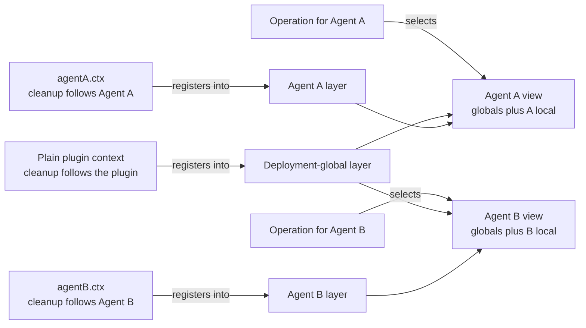
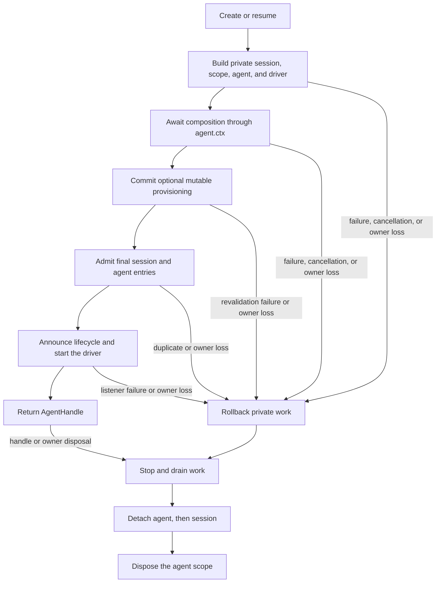

# Agent Note: Der Agent ist ein Registrierungs-Scope
[English](2026-07-08-agent-scope-contexts.md) | [中文](2026-07-08-agent-scope-contexts.zh.md) | Deutsch

Status: implemented


## Problem

Eine Anwendung muss Infrastruktur über viele Agenten hinweg teilen, während jeder Agent eigene Tools, Prompt-Beiträge, Policies und Listener haben kann. Geteilte Adapter, Persistenz und Benutzeroberflächen gehören zum Deployment; eine Persona, Tool-Variante oder ein Listener gehört oft zu einem einzelnen Agenten.

Ein separater Service-Graph pro Agent dupliziert geteilte Infrastruktur. Ein globaler Registrierungs-Graph hat das entgegengesetzte Versagen: Ein agent-spezifischer Beitrag kann in unbeteiligte Agenten lecken. Mitwirkende brauchen einen gewöhnlichen Registrierungs-Mechanismus, der sowohl bestimmt, wer einen Beitrag sehen kann, als auch wann er aufgeräumt wird.

Der Mechanismus braucht außerdem eine Publikationsgrenze. Ein Agent darf nicht sichtbar werden, bevor seine lokale Welt vollständig ist, und Teardown muss diese Welt behalten, bis finale Arbeit gestoppt ist.

## Entscheidung

Jeder lebende Agent besitzt eine flache Registrierungsschicht, exponiert als `agent.ctx`. Code registriert über den Kontext, der einen Beitrag besitzt; scope-bewusste Services kombinieren Deployment-globale Registrierungen mit genau einer passenden Agent-Schicht; Operationen wählen diese Schicht aus ihrem echten Agenten; und die Schicht existiert für die gesamte publizierte Lebensdauer des Agenten.

`agent.ctx` trägt Registrierungs-Ownership und den Scope-Schlüssel; es exponiert keine umgekehrte `agent`-Property. Code, der das Domain-Subjekt braucht, erhält es explizit: `AgentSetup` erhält `(agentCtx, agent)`, und gescopte Events tragen ihr Subjekt im Payload.

Cordis ist das Plugin-Framework unter dem SDK. Ein Cordis-**Kontext** ist das Objekt, über das Plugins auf Services zugreifen und Effekte registrieren, deren Aufräumung diesem Kontext folgt. Der [Cordis-Primer](../../../../docs/cordis-primer.de.md) erklärt das Framework im Detail.

Für die meisten Mitwirkenden ist der vollständige Vertrag vier Regeln:

| Frage | Regel |
|---|---|
| Wo registriere ich Verhalten für einen Agenten? | Die gewöhnliche Registrierungs-API über `agent.ctx` aufrufen |
| Was sieht eine Operation für einen Agenten? | Deployment-Globale plus die Schicht dieses Agenten, unter den Merge-Regeln des besitzenden Services |
| Welche gescopten Listener laufen? | Ungescopte Listener plus Listener, die für den Agenten der Operation registriert sind |
| Wie lange existiert die Schicht? | Setup wird vor Publikation abgeschlossen; Disposal behält sie, bis Arbeit Quieszenz erreicht |

Der Scope ist flach. Auflösung läuft nie Eltern- oder Geschwister-Scopes ab, und Lifetime-Ownership impliziert keine Registrierungs-Vererbung.



Die fehlenden Kreuzkanten sind die Isolationsregel: Agent As lokale Registrierungen gehen nicht in Agent Bs View ein, und die Registrierungen eines Elternteils gehen nicht in ein Kind ein, nur weil der Elternteil die Lebensdauer des Kindes besitzt.

Die Begleit-[Runtime-Design-Agent-Note](2026-07-12-agent-scope-runtime-design.de.md) erklärt die Implementation und das Korrektheits-Reasoning. Die [Agent-Note zur expliziten Runtime-Identität](2026-08-31-explicit-agent-runtime-identity.de.md) besitzt, warum Lifecycle-, Event- und Transport-Interfaces Agent-Identität übergeben statt sie über Context zu exponieren. Die [Subagent-Composition-Controls-Agent-Note](../feature/2026-07-12-subagent-persona-tool-filter-and-depth.de.md) besitzt das separate `persona`-, `toolFilter`- und `maxDepth`-Feature.

### Registrierungs-Ursprung wählt Sichtbarkeit und Aufräumung

Eine Registrierung über einen plain Plugin-Kontext ist Deployment-global und wird mit diesem Plugin disposed. Dieselbe Methode, über `agent.ctx` aufgerufen, trägt zu einem Agenten bei und wird mit dem Scope dieses Agenten disposed.

| Registrierungs-Ursprung | Default-Sichtbarkeit | Disposed mit |
|---|---|---|
| Plain Plugin-Kontext | Jeder eligible Agent-View | Registrierendes Plugin |
| `agent.ctx` | Genau der View dieses Agenten | Agent-Scope |

Tools, Prompt-Sections und -Variablen, Tool-Restriktionen, Guards und gescopte Event-Listener übernehmen diesen Vertrag. Benannte lokale Werte überlagern gewöhnlich einen gleichnamigen globalen Wert für diesen Agenten; jeder besitzende Service dokumentiert Ausnahmen und Merge-Verhalten.

Das gewöhnliche Contributor-Muster ist, die vollständige lokale Welt während Agent-Setup zu registrieren:

```js
const handle = await ctx.agents.create({
  sessionId: SessionId('reviewer'),
  agentOptions: { model: 'model-name' },
  setup(agentCtx) {
    agentCtx.systemPrompt.section({
      name: 'deployment:persona-prefix',
      order: 0,
      text: 'Review code, but do not modify files.',
    })
    agentCtx.tools.register({
      name: 'review_summary',
      description: 'Return the review summary.',
      parameters: { type: 'object', properties: {} },
      async execute() {
        return [{ type: 'text', text: 'review complete' }]
      },
    })
  },
})

ctx.tools.get('review_summary')                // undefined: not global
ctx.tools.get('review_summary', handle.agent)  // the reviewer-local tool

await handle.dispose()
ctx.tools.get('review_summary', handle.agent)  // undefined: scope is gone
```

Setup erhält den vollständigen vertrauenswürdigen Cordis-Kontext und den unpublizierten Agenten, sodass es gewöhnliche Plugins und Services komponieren kann, während es bei Bedarf die exakte Child-Session liest. Sein Vertrag ist nur Komposition: Den in-flight Agenten über Casts oder interne Registry-Aufrufe zu treiben oder zu publizieren wird nicht unterstützt.

### Die Operation wählt den View

Registrierungs-Ursprung und Operations-Subjekt sind getrennte Fakten. Einen Service über `agent.ctx` aufzurufen wählt, wo eine neue Registrierung hingehört; es bindet spätere Reads nicht an diesen Agenten.

Tool-Lookup und -Ausführung erhalten den Agenten, für den sie handeln. Prompt-Assembly erhält einen Assembly-Kontext für den Agenten, dessen Request gebaut wird. Event-Dispatch erhält sein Domain-Subjekt. Das hält geteilte Service-Instanzen über Agenten hinweg wiederverwendbar und macht den View jeder Operation explizit.

Nur Services, die den Scope-Vertrag übernehmen, lösen eine Agent-Schicht auf. `agent.ctx` ändert nicht automatisch beliebige Cordis-Service-Aufrufe.

### Gescopte Events halten Routing getrennt von Event-Daten

Ein Event über Agent A erreicht normalerweise ungescopte Listener und A-gescopte Listener, nicht B-gescopte Listener. Ein Event ohne Agent-Subjekt erreicht nur ungescopte Listener.

Auf Cordis-Ebene ist `Scoped<T>` ein opaker Routing-Empfänger. Es trägt den Filter, der zur Listener-Auswahl dient, ist aber nicht das Domain-Objekt. Event-Signaturen behalten daher den echten `Agent`, die Tool-Ausführung, den Approval-Request oder ein anderes Subjekt als explizites Argument, das Listener inspizieren können.

Ein mit `{ global: true }` registrierter Listener umgeht bewusst kontextuelle Audience-Filterung, während sein Aufräumung weiterhin dem registrierenden Kontext folgt. Registry-Membership-Benachrichtigungen bleiben ungefiltert, weil sie geteilten Registry-Zustand beschreiben statt die Operation eines Agenten. Die erschöpfende Event-Referenz ist die Menge der generierten `cordis-surface`-Regionen über die [Subsystem-Seiten](../../../../docs/subsystems/core.de.md) — jeder Event-Scope auf seiner besitzenden Seite (`agent/*` und `agent-loop/*` auf core.md selbst).

### Erstellung publiziert zuletzt und Disposal widerruft zuletzt

`ctx.agents.create()` und `resume()` bauen eine unpublizierte Session, Scope, Agent und Driver. Sie warten `setup` ab, rufen synchron sein optionales `AgentSetupCommit` auf, lassen die finalen Session- und Agent-Einträge zu, kündigen sie der Reihe nach an, starten den Loop und geben erst dann ein Handle zurück. Der Commit lässt mutables Provisioning an der exakten Publikationsgrenze nach jedem Setup-Await revalidieren; ein Throw rollt die private Transaktion zurück, bevor eine der Identitäten angekündigt wird, während Widerruf nach erfolgreichem Commit gewöhnlicher Live-Teardown ist.

Ein optionales Creation-Signal bricht Arbeit nur ab, solange Create oder Resume pending ist. Nachdem das Promise aufgelöst ist, besitzt das zurückgegebene `AgentHandle` explizites Disposal.

Wenn Laden, Setup, der optionale Setup-Commit, Zulassung oder Publikation fehlschlägt, rollt die private Transaktion alles zurück, was sie vorbereitet hat. Nebenläufige Operationen mit derselben caller-gelieferten Live-ID können beide Setup erreichen, aber der finale Registry-Eintrag lässt nur einen zu; jeder Verlierer rejected und räumt seine privaten Ressourcen auf. Sequentielle Wiederverwendung nach abgewartetem Disposal bleibt valide.

`AgentHandle.dispose()` kehrt die Grenze um. Es deaktiviert Erstellung oder Treiben, wartet, bis synchrone Publikation abgewickelt ist, stoppt und drainen Driver und finale Session-Flushes, detacht Agent und Session und disposed schließlich den Scope. Wiederholte oder racende Disposal-Anfragen joinen ein Completion-Promise.

Der aufrufende Cordis-Kontext und die konkrete AgentLoop-Factory sind strukturelle Co-Owner. Das Entladen eines der beiden disposed die Transaktion oder den lebenden Agenten.



## Sicherheit und Autorität sind Non-Goals

Agent-Scopes komponieren vertrauenswürdige Same-Process-Registrierungen. Sie sandboxen keine Plugins, definieren kein Eltern-zu-Kind-Autoritätsgitter, frieren Grants bei Erstellung nicht ein und garantieren nicht, dass ein Kind nicht mehr kann als sein Elternteil.

Ein Elternteil darf ein Kind besitzen, dessen sichtbare Tools breiter sind als seine eigenen, weil Lifetime-Ownership keine Registrierungen spendiert oder deckelt. Ein Plugin, das einen Cordis-Kontext hält, läuft ebenfalls im selben Prozess und kann verfügbare Services direkt aufrufen.

Deployments, die Non-Escalation brauchen, erfordern eine separate Autoritäts-Repräsentation, Propagations-Regel und Execution-Check. Parent-Subset-Grants, Creation-Time-Authorization-Snapshots, explizite Future-Grant-APIs und generische Capability/Output/Termination-Tags liegen außerhalb dieser Entscheidung.

## Erwogene Alternativen

Die abgelehnten Designs trennen entweder Sichtbarkeit von Aufräumung, decken nur eine Registrierungsfamilie ab, duplizieren geteilte Infrastruktur oder vermischen Lifetime-Ownership mit Vererbung.

### Eine Agent-Option an jede Registrierung übergeben

Eine API wie `tools.register(definition, { agent })` wiederholt Scope-Plumbing in jeder Registry und erlaubt, dass Sichtbarkeits-Ownership von Aufräum-Ownership driftet. Über `agent.ctx` zu registrieren lässt beide Fakten einem Cordis-Effect-Owner folgen.

### Events filtern bei globalen Registries

Listener-Filterung verhindert, dass der falsche Hook läuft, scopet aber keine Tool-Schemas, Executable-Lookups, Prompt-Sections, Variablen oder andere registrierte Daten. Agent-lokale Komposition würde weiterhin temporäre globale Mutation erfordern.

### Einen Service-Graph pro Agent erstellen

Der benötigte View ist geteilte Deployment-Services plus eine lokale Registrierungsschicht. Per-Agent-Graphen duplizieren Adapter und verkomplizieren geteilte Persistenz, Provider-Registries und Application-Boot.

### Eltern-Registrierungs-Scopes erben

Verwandtschaft beschreibt Lebensdauer und Konversations-Abstammung, keine universelle Merge-Policy. Hierarchischer Lookup lässt unbeteiligte Services versehentlich erben und kann Sicherheit nicht ohne separates Autoritätsmodell definieren.

## Konsequenzen

Contributors nutzen ein vertrautes Muster: Geteiltes Verhalten über einen Plugin-Kontext registrieren, lokales Verhalten über `agent.ctx` registrieren, den echten Agenten bei Operationen wählen und das zurückgegebene Handle disposen. Setup und sein optionaler Publikations-Commit sind aus Beobachter-Sicht atomar, und Teardown bewahrt lokales Verhalten, bis Arbeit stoppt.

Die Kosten sind explizite Subjekt-Auswahl, asynchrone programmatische Erstellung und Service-spezifische Scope-Adoption. Flacher Registrierungs-Scope ist bewusst keine Autorität, und Subagent-Composition-Controls bleiben ein separates Feature statt versteckter Scope-Semantik.
