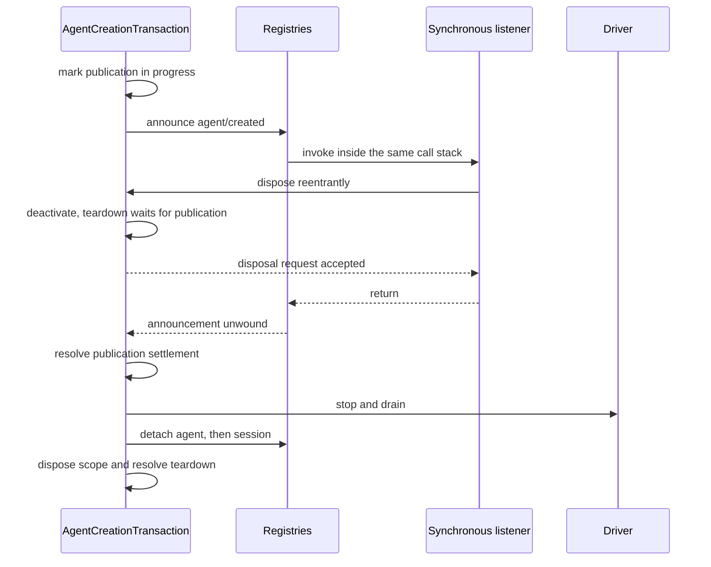

# Agent Note: Agent-Scope-Runtime-Design und Korrektheit
[English](2026-07-12-agent-scope-runtime-design.md) | [中文](2026-07-12-agent-scope-runtime-design.zh.md) | Deutsch

Status: implemented

## Problem

Der [Agent-Scope-Contract](2026-07-08-agent-scope-contexts.de.md) ist für Contributors einfach: über `agent.ctx` registrieren, eine Global-plus-Agent-Sicht auflösen, erst nach dem Setup veröffentlichen und den Scope behalten, bis die Arbeit endet. Die Runtime muss diesen Contract über ein kooperatives Plugin-Framework, asynchrone Erzeugung, reentrante Listener, durable Session-Commits und Worker- oder Prozessfehler hinweg bewahren.

Das zentrale Designrisiko ist ein zweiter Mechanismus für jede Race-Bedingung. Getrennte Reservierungen, Readiness-Sentinels, Cancellation-Relays, Snapshot-Schichten und Schutz-Registries können denselben Fakt spiegeln, bis kein Leser mehr sagen kann, welcher davon autoritativ ist. Diese Maschinerie verleitet die Runtime außerdem dazu, vertrauenswürdige getypte Aufrufe wie feindliche Serialisierungsgrenzen zu behandeln.

Die Implementierung braucht gerade so viel State, wie nötig ist, um echte Ownership- und Settlement-Grenzen zu bewahren — aber nicht mehr. Ein Korrektheits-Reviewer muss einen einzelnen Fakt von der Annahme über die Veröffentlichung bis zum Teardown verfolgen können, ohne parallele Repräsentationen abgleichen zu müssen.

## Entscheidung

Die Runtime nutzt genau einen Mechanismus pro unabhängigem Fakt. Scope-Routing hat einen opaken Träger und einen gemeinsamen Layer-Store; jedes lebende Registry-Objekt hat einen Entry-Record; jede Create- oder Resume-Operation hat eine Transaktion; getypte Same-Process-Aufrufe leihen Readonly-Werte; reale Datengrenzen materialisieren genau einmal; das kooperative Prompt-Assembly-Ergebnis ist autoritativ; und Worker-/Prozess-Code behält getrennten Terminal- und Quiescence-State nur dort, wo verschiedene Owner wirklich racen können.

Das Design lässt sich als sieben Entscheidungen überfliegen:

| Problem | Autoritativer Mechanismus |
|---|---|
| Global plus die Registrierungen eines Agent auswählen | Opaker Scope-Key, Routing-Träger und gemeinsamer Layer-Store |
| Einen lebenden Agent oder eine Session besitzen | Ein Registry-Entry, den sein Disposer captured |
| Create/Resume koordinieren | Eine `AgentCreationTransaction` |
| Durable, gequeuete, Modell- oder Wire-Daten schützen | Genau einmal an dieser Grenze materialisieren |
| Getypte Werte innerhalb eines Prozesses übergeben | Readonly-Borrow-Contract |
| Den modell-sichtbaren Prompt und das Tool-Set zusammensetzen | Eine gemeinsame Tool-Sicht plus das autoritative Assembly-Waterfall-Ergebnis |
| Subagent-, Worker- und Prozess-Shutdown koordinieren | Ein Cancellation-Signal plus die unabhängigen Terminal-/Quiescence-Fakten dieser Grenze |

Der Rest dieser Agent Note vertieft diese Entscheidungen in Abhängigkeitsreihenfolge: Cordis-Mechanik, Scope-Routing, Erzeugung und Session-Commit, Tools und Prompts, Subagents und Workflows, danach ausführbare Prüfungen.

Die [Agent Note vom 8. Juli](2026-07-08-agent-scope-contexts.de.md) bleibt der Contributor-Contract. Die separate [Subagent-Composition-Controls-Agent-Note](../feature/2026-07-12-subagent-persona-tool-filter-and-depth.de.md) besitzt `persona`, `toolFilter` und `maxDepth`; dieses Dokument behandelt nur, wie deren Setup in den Lebenszyklus passt.

## Cordis-Modell: Context, Fiber, Effect, Receiver und Waterfall

Fünf Cordis-Ideen sind nötig, um die Implementierung zu verstehen. Ein Context wählt Services und Registrierungs-Ownership; ein Fiber ist ein lebendes Plugin- oder Child-Lifecycle; ein Effect hängt Cleanup an einen Fiber; ein Event-Receiver wählt Listener; und ein Waterfall lässt Listener eine Operation der Reihe nach transformieren oder kurzschließen.

### Ein Context ist ein Ownership-Pfad durch einen Service-Graphen

Alle Agents teilen einen Cordis-Service-Graphen. Ein abgeleiteter Context klont weder `ToolRuntime`, `SystemPrompt`, Persistence noch Modell-Adapter; er ändert, wie über diesen Context getätigte Registrierungen getaggt werden und welche Effects ihr Cleanup besitzen.

`agent.ctx` ist ein solcher abgeleiteter Context. Service-Aufrufe erreichen weiterhin die gemeinsamen Instanzen, während eine Registrierung ihren aufrufenden Context inspizieren und einen Beitrag unter dem nächsten Scope-Key ablegen kann. Gewöhnliche Plugin-Contexts tragen keinen Scope-Key und registrieren daher global.

Der Agent-Context ist exakt der von `createScope` zurückgegebene Context; er trägt keine zweite Rückwärtsassoziation zum Agent. Subject-tragende APIs übergeben den Agent explizit, sodass ein formales Scope-Mechanismus für Registrierungs-Ownership und Routing übrig bleibt.

### Fibers und Effects machen Cleanup strukturell

Ein Cordis-Fiber ist die lebende Instanz, die entsteht, wenn ein Plugin oder Child-Context aktiviert wird. Sein State zeichnet auf, ob dieses Lifecycle aktiv, unloading, failed oder disposed ist. `ctx.effect()` und `ctx.on()` geben Disposer zurück und hängen diese Disposer zugleich an den registrierenden Fiber — das Unloaden eines Plugins oder Agent-Scopes entfernt damit alles, was über diesen Context registriert wurde, ohne ein separates Inventar.

Die vendored Cordis-Fiber-Implementierung etabliert Ownership, bevor beliebiges Setup oder `internal/plugin`-Observer laufen. Ein reentrantes Unload kann den gestarteten Child-Fiber oder Effect sehen, nach Unload-Beginn hinzugefügte Effects ablehnen und bereits gestartetes Cleanup über einen öffentlichen Single-Shot-Disposer joinen. Teardown-Observer werden einzeln eingegrenzt, damit ein einzelner Callback das strukturelle Cleanup nicht verhindern kann.

Das sind Framework-Lifecycle-Garantien, keine Agent-spezifische Policy. Die Agent-Erzeugung hängt von ihnen ab, weil Setup beliebige Plugins aktivieren und synchron in das Owner-Disposal reentrieren kann.

### Receiver routen Listener; Waterfalls komponieren Entscheidungen

Cordis filtert Listener über den Dispatch-Receiver (`this`), während Harness-Listener einen expliziten Agent, eine Execution, einen Request oder ein anderes Subject brauchen. `Scoped<T>` markiert den von einer Scoped-Event-Deklaration erwarteten Receiver, aber der Runtime-Träger exponiert bewusst keine Subject-API.

Produkt-Helper konstruieren daher den Träger und übergeben das Domain-Subject separat. Das verhindert, dass Listener-Routing zu einem alternativen Objektmodell wird, und hält Event-Signaturen ohne Kenntnis der Träger-Interna verständlich.

Ein Cordis-Waterfall ist Middleware-artiges Dispatch. Jeder Listener erhält `next()`: Sein Aufruf delegiert an die verbleibenden Listener und die Basis-Operation, während ein Return ohne `next()` das Downstream-Ergebnis kurzschließt oder ersetzt. Waterfalls treiben Prompt-Assembly und Tool-Policy; gewöhnliche Emit-Events benachrichtigen synchron, und parallele Events warten alle Listener ab, ohne ein Veto-Ergebnis.

## Scope-Routing: Ein opaker Key wählt einen Layer

Das Scope-Package implementiert das kleinste für Cordis-Routing nötige Objekt. Sein Träger hält nur einen komponierten Service-Filter und ein Scope-Prädikat, während das Package den opaken Key privat führt und den quiescenten Disposer des Scope-Fibers separat exponiert.

### Scope-Identität nutzt Objektidentität

Ein `ScopeKey` ist ein opakes, per Identität verglichenes Objekt. Der Harness nutzt den lebenden `Agent` als seinen eigenen Key, aber das Primitiv ist domänenneutral und unterstützt andere Scoped-Owner.

`createScope(parent, key)` gibt einen Scope zurück, dessen `ctx` die Services des Parents teilt und dessen Effects mit jenem Key getaggt sind. `scopeOf(ctx)` liest den nächsten Registrierungs-Key. `scopeTarget(base, key)` erzeugt den Event-Receiver, dessen Filter den Cordis-Service-Filter des Basis-Receivers bewahrt und dann unscoped Listener sowie Listener mit exakt diesem Key zulässt.

Der Receiver ist ein kleiner Träger, kein transparenter Proxy für das Domain-Objekt. Code, der den Agent braucht, erhält einen expliziten Setup-Parameter oder ein Event-Argument; Code, der Registrierungs-Ownership braucht, erhält `agent.ctx`.

### Registry-Reads überlagern genau einen Layer

Scope-aware Registries nutzen `ScopedLayers`, um ein eagerness Global-Aggregat und lazy erzeugte identitätsgesteuerte Aggregate zu besitzen. Ein Read löst den Global-Layer und höchstens einen exakten lokalen Layer auf; er erzeugt niemals State und traversiert keine Parent-Kette. Registrierungs-Sichtbarkeit und Cordis-Effect-Ownership leiten sich aus demselben Context ab, und Reclamation wartet, bis das komplette Aggregat des konkreten Layers leer ist ([Entscheidung](../../archived/architecture/2026-07-12-scoped-layers-store.md)).

Jeder Service behält seine Domain-Regel. Benannte Command- und Prompt-Views nutzen den gemeinsamen einfügegeordneten Shadow-Merge; Tools behalten einen reicheren Resolver, weil Restrictions Globals filtern, bevor lokale Tools hinzukommen, und der reservierte PTC-Modus-Transport separat eingefügt wird. Prompt-Variablen und Tool-Guards behalten Live-Iteration, während Tool-Provider-Membership pro Assembly materialisiert wird. Scope liefert Storage-Lifecycle und benanntes Shadowing, keine universelle Registry-Sicht.

### Fusionierte Dispatch-Helper verhindern Subject-Drift

`agentEvents(context, agent)` konstruiert den Träger des Agent und injiziert denselben Agent als Event-Subject. Session-, Tool-, Approval-, Prompt- und Subagent-Services leiten ihr Routing ebenfalls von dem Objekt ab, das sie bereits besitzen, statt einen fremden Key entgegenzunehmen.

Der Type-Marker weist gewöhnliche Bare-Receiver-Fehler zurück, und Development-Invariants decken direktes JavaScript- oder gecastetes Dispatch ab. Das Subject bleibt explizit, weil Routing-Korrektheit und nützliche Event-Daten unterschiedliche Anliegen sind.

## Agent-Erzeugung: Eine Transaktion besitzt die komplette Operation

Create und Resume sind ein asynchrones Lifecycle mit mehreren Phasen, nicht mehrere Lifecycles. `AgentCreationTransaction` besitzt Caller- und Factory-Liveness, optionale Cancellation, private Ressourcen, Veröffentlichung, Rollback und den memoized Teardown, den jeder Owner beobachtet.

### Registry-Entries sind die einzigen Live-Identity-Records

AgentRegistry und SessionStore halten jeweils genau einen Entry pro lebendem Objekt. Der Entry hält die stabile ID, das Objekt, den Scoped-Träger und die kleine Menge Publication- oder Append-State, die zu diesem Objekt gehört.

Eine Detach-Closure captured ihren exakten Entry. Sie löscht nur, wenn die Map noch auf diesen Entry zeigt, sodass ein alter Disposer kein späteres Objekt löschen kann, das dieselbe ID wiederverwendet. Keine Registry liest ein mutables Caller-Objekt erneut, um Identität zu entscheiden.

Es gibt keine Reservierungs-API. Caller-gelieferte IDs werden beim finalen Entry zugelassen. Konkurrierende Same-ID-Operationen können beide ihr privates Setup abschließen; exakt ein finales `enter()` gewinnt, und jeder Verlierer rollt seine privaten Ressourcen zurück. Sequentielle Wiederverwendung ist gültig, sobald der frühere Disposer Quiescence erreicht.

### Die Transaktion besitzt die Vorbereitung, bevor sie abgewartet wird

Die Transaktion wird sowohl unter dem aufrufenden Cordis-Context als auch unter der konkreten AgentLoop-Factory installiert, bevor Persistence-Load oder Setup suspendieren kann. Sie beobachtet zudem ein optionales Create-/Resume-Signal, bis die öffentliche Operation settled.

Create bereitet eine neue Session vor. Resume lädt und validiert die persistierte Session, bevor es dieselbe Live-Session-Identität vorbereitet. Beide Pfade bauen dann Scope, Agent und Driver und rufen denselben Setup-/Publication-Algorithmus auf.

Die Factory speichert konkrete Trace-Ziele, ruft sie aber über einen Caller-gebundenen Cordis-Trace auf. Ein Runtime-Child-Creator setzt `parentAgent` in den Create- oder Resume-Optionen, und AgentRegistry reicht diese Optionen weiter, ohne aus dem Caller-Context einen Parent abzuleiten. Das bewahrt die Abhängigkeitsherkunft und beide Ownership-Fakten, ohne Trace-Proxies zu stapeln oder ein Domain-Objekt an den Context zu hängen. Scoped-Remote-Event-Adapter erhalten den Agent ebenfalls im Request, verifizieren, dass er der Träger-Key ist, und projizieren Context und Wire-Identität direkt. Kein Scope-Index rekonstruiert einen Agent aus einem Context. Die [Explizite-Runtime-Identity-Entscheidung](2026-08-31-explicit-agent-runtime-identity.de.md) besitzt diese Trennung und die daraus folgende Continuable-Child-Ownership-Regel.

### Setup ist vertrauenswürdige Komposition in einer privaten Welt

Setup erhält den vollständigen Child-Context und den exakten unveröffentlichten Agent und darf Plugin-Aktivierung abwarten. Es kann Tools, Prompt-Abschnitte, Restrictions, Listener und andere Effects registrieren; Consumers, die die Session des Child brauchen, lesen sie aus dem Agent-Parameter. Der öffentliche Contract unterstützt nicht, den in-flight Agent über Casts oder interne Registry-Aufrufe zu treiben oder zu veröffentlichen.

Die Transaktion ract asynchrones Load und Setup gegen Deaktivierung, statt unbegrenzt auf ein fremdes Promise zu warten. Wenn Cancellation oder Owner-Unload gewinnt, rejected die öffentliche Erzeugung nach transaktionseigenem Cleanup — selbst wenn das externe Promise nie settled.

### Veröffentlichung hat einen geordneten Commit-Pfad

Die Veröffentlichung nimmt Ressourcen in der von Observern geforderten Reihenfolge auf und kündigt sie an:

1. Session eintragen.
2. Agent eintragen.
3. `session/created` ankündigen.
4. `agent/created` ankündigen.
5. Öffentliches Driving aktivieren.
6. `agent/session-start` emittieren.
7. Den Driver starten.

Der Agent drivet niemals, bevor beide Registries und die Creation-Benachrichtigungen übereinstimmen. Ein synchroner Listener darf ein Veto einlegen oder einen Owner disposen; die Transaktion vermerkt die laufende Veröffentlichung und wartet, bis jener Callback-Stack abgewickelt ist, bevor der Teardown weiterläuft. Jede begonnene Creation-Ankündigung hat eine passende Disposal-Ankündigung während des Rollbacks.

Das Sequenzdiagramm isoliert die nicht-offensichtliche Race-Bedingung: Ein synchroner Creation-Listener kann Disposal anfordern, während der Publication-Call-Stack noch beide Registry-Entries besitzt. Der Teardown muss sofort deaktivieren, aber warten, bis jener Stack abgewickelt ist, bevor er etwas stoppt und detacht.

### Teardown bewahrt Arbeit, bevor Registrierungen widerrufen werden

Jede Teardown-Anfrage joint einen memoized Pfad. Die Reihenfolge ist:

1. Creation oder Driving deaktivieren und synchrone Veröffentlichung zu Ende laufen lassen.
2. Den Driver stoppen und drainen; jede noch ausstehende Injection verwerfen.
3. Den Agent detachen.
4. Die Session detachen.
5. Den Agent-Scope disposen.
6. Das Transaktions-Ownership-Tracking einstellen.

Diese Reihenfolge erlaubt den finalen Agent- und Session-Events, die passenden Scoped-Listener zu nutzen, und hält Persistence-Observer bis zum finalen Flush attached. Der Scope-Disposal kommt zuletzt, weil der Registrierungs-Widerruf die extern sichtbare Lifetime-Grenze ist.

## Session-Append: Materialisieren, validieren, committen, benachrichtigen

Session-Events überqueren eine durable Grenze, darum besitzt Append ihre Daten. Der Rest des Algorithmus nutzt einen attached Entry und einen Commit-Punkt.

### Durable Daten werden genau einmal materialisiert

Session-Header, Seeds und angehängte Events sind verlustfreie JSON-Daten. Der Session-Konstruktor oder der Append-Pfad materialisiert und validiert sie vor der Speicherung und exponiert gefrorene Snapshots, sodass spätere Caller-Mutation weder Persistence, Replay noch Modell-Rekonstruktion ändern kann.

Das ist eine reale Ownership-Grenze: Die Werte verlassen den Caller, können persistiert werden und müssen später denselben Request rekonstruieren. Sie ist bewusst strenger als ein getypter Same-Process-Callback oder eine Registry-Definition.

### Pre-Commit-Listener können ein Veto einlegen; Post-Commit-Observer nicht

Append folgt einer Sequenz:

1. Das durable Event materialisieren und die Absicht sichtbar machen.
2. Den SessionEntry claimen und reentranten Append auf diesem Entry ablehnen.
3. Scoped-Callbacks auflösen und interne Invarianten-Validierung ausführen.
4. Exakt einmal pushen; das ist der Commit-Punkt.
5. Jeden Observer unabhängig benachrichtigen, synchrone und asynchrone Fehler eingrenzen.
6. Append-State freigeben und ein während der Veröffentlichung angefordertes Detach honorieren.

Kein Observer-Fehler lässt ein committetes Event uncommittet aussehen, und ein fehlerhafter Listener kann spätere Listener nicht aushungern. Session-Invariants stagen ihren Übergang vor dem Commit und wenden ihn nur an, wenn dasselbe Event den eingegrenzten Post-Commit-Observer erreicht.

`flush()` startet jeden Persistence-Listener und wartet jedes Ergebnis ab, bevor es einen Fehler meldet. Dieses bewusste All-Settled-Verhalten verhindert, dass ein synchroner Fehler ein anderes Backend oder einen finalen Flush aushungert.

## Vertrauensgrenzen: Nur kopieren, wenn Ownership sich wirklich ändert

Die Runtime unterscheidet getypte In-Process-Contracts von Serialisierungs- und Durability-Grenzen. Das ist die zentrale Vereinfachungsregel für Werte und Callbacks.

| Grenze | Ownership-Regel |
|---|---|
| Getypter Service-/Plugin-Aufruf im selben Prozess | Readonly-Werte und -Callbacks leihen |
| Geparste Plugin-Konfiguration oder externe Datei | Semantische und strukturelle Eingabe validieren |
| Gequeuete Inbox-Message | Vor asynchronem Konsum materialisieren |
| Modell-/Tool-JSON-Input oder -Output | An der Modell-/Tool-Grenze materialisieren |
| Durable Session- oder Persistence-Daten | Vor dem Commit materialisieren und validieren |
| Worker-, Prozess- oder Wire-Message | Serialisieren, validieren und den dekodierten Wert besitzen |

Tests, die feindliche Getter fabrizieren, getypte Callbacks nach der Übergabe ersetzen oder Fake-Service-Objekte casten, definieren für sich genommen keinen Produktions-Contract. Die Runtime hält Prüfungen dort, wo Daten eine Parser-, Queue-, Modell-, Durable-, Datei-, Worker-, Prozess- oder Wire-Grenze überqueren, und verlässt sich innerhalb des vertrauenswürdigen Prozesses auf Readonly-Typen plus Plugin-Disziplin.

Callback-Eingrenzung ist getrennt von Daten-Ownership. Listener sind beliebiger Extension-Code und können selbst dann werfen, wenn ihre Argumente vertrauenswürdig sind; Publication- und Post-Commit-Pfade grenzen Fehler weiterhin gemäß ihrem Event-Contract ein.

## Tools und Prompts: Eine Sicht, autoritative Assembly, committete Ergebnisse

Tool-Präsentation und -Ausführung teilen einen privaten Resolver. Prompt-Assembly bleibt vertrauenswürdige kooperative Komposition: Registries liefern den geordneten Input, und der Rückgabewert des Assembly-Waterfalls ist exakt das, was der Loop loggt und sendet. Die Ausführung nutzt separate Einweg-Grenzen nur dort, wo Policy oder Ergebnis-Settlement monoton sein muss.

### Ein Resolver definiert die Tool-Sicht

Der private Resolver wendet den aktuellen Präsentationsmodus, Live-Global-Restrictions, das exakte lokale Overlay und lokales Shadowing an. Schemas, Lookup, Ausführung, PTC-Modus-SDK-Generierung und Restriction-Validierung nutzen alle diesen Resolver oder seine Pre-Restriction-Global-Name-Sicht.

Die [Subagent-Composition-Controls-Agent-Note](../feature/2026-07-12-subagent-persona-tool-filter-and-depth.de.md#tool-filtering-is-one-live-global-view-rule) besitzt die nutzersichtbare Allow-/Deny-Semantik. Die Implementierungsanforderung ist Übereinstimmung: Ein weggefiltertes Global darf nicht über einen anderen Lookup-Pfad ausführbar bleiben, und eine lokal geshadowte Definition ist dieselbe Definition, die präsentiert und ausgeführt wird.

`ToolRestriction` akzeptiert Readonly-Allow-/-Deny-Namen und kompiliert sie in interne Sets. Mehrere Restrictions schneiden sich. Öffentliche `visible()`- und `knownNames()`-Methoden sind unnötig, weil nur die Registry die Zwischensichten braucht.

### Tool-Ausführung besitzt Identität und Grenz-Materialisierung

Die Registry weist jeder Ausführung ein frisches gebrandetes `Symbol`-Token zu. Geschachtelte PTC-Modus-Aufrufe tragen das äußere Token als `parent`, sodass strukturierte Ausgabe eine innere Capture über die Identität mit ihrem umschließenden `run_code`-Ergebnis korrelieren kann.

Ein frisches registry-vergebenes Symbol liefert kollisionsfreie Ausführungs-Identität ohne eine WeakSet-Membership-Registry. Caller können das eigene Token der Ausführung nicht über `ToolExecutionInput` liefern; sie erhalten lediglich die pipeline-eigene `ToolExecution`, nachdem die Registry sie erzeugt hat. Das ist ein vertrauenswürdiger getypter Contract, keine Runtime-Abwehr gegen beliebige Casts oder JavaScript-Caller.

Argumente werden genau einmal materialisiert, wo Modell-/Tool-JSON in die Pipeline eintritt. Pre-, Around- und Post-Execute-Listener operieren auf der getypten Execution und den Entscheidungen. Call-ID-Korrelation, Approval, monotonische Guards und PTC-Modus-Verschachtelung bleiben explizite relationale Prüfungen.

Nach Post-Execute- oder Outer-Pipeline-Normalisierung snapshotet die Registry das Kandidaten-Ergebnis verlustfrei, wandelt einen Snapshot-Fehler in einen gewöhnlichen Fehler um, ruft den gesnapshotteten optionalen `ToolDefinition.finalizeContent`-Callback des Calls auf und materialisiert und friert dann das akzeptierte Endergebnis genau einmal ein. Der Callback darf nur Content ersetzen, sodass strukturierte Fehler-Identität, Contexts und Metadaten registry-owned bleiben, selbst wenn ein Tool eine Last-Mile-Ergebnisschranke durchsetzt. Jeder synchrone `tools/result`-Observer erhält exakt dieses committete Objekt, und Observer-Fehler werden einzeln eingegrenzt. Ein Outer-Pipeline- oder Kandidaten-Snapshot-Fehler wird vor dem finalen Content normalisiert, sodass Observer gestagte Arbeit an derselben autoritativen Grenze verwerfen können.

### Das Assembly-Waterfall besitzt die finale modell-sichtbare Komposition

SystemPrompt löst zunächst die Global-plus-Agent-Abschnitte, -Variablen und Tool-Provider in einen deterministischen Registry-Beitrag auf. Der scope-gefilterte `system-prompt/assemble`-Waterfall darf dann jeden Abschnitt, jede Variable oder jedes Schema umordnen, ersetzen, hinzufügen oder entfernen. Seine zurückgegebene Assembly ist autoritativ; es gibt keinen späteren Wiederherstellungs-Pass und keine Finality-Metadaten auf gewöhnlichen Prompt-Abschnitten, Tool-Definitionen oder Provider-Ergebnissen.

Das ist ein vertrauenswürdiger Same-Process-Extension-Point, keine Autoritätsgrenze. Ein Listener, der das `run_code`-Schema des PTC-Modus oder die `tools:sdk`-Instruktionen ändert oder das Capture-Schema bzw. die Instruktion eines Structured-Childs, besitzt die Bewahrung eines kohärenten Protokolls in der Assembly, die er zurückgibt. ToolRuntime reserviert `run_code` weiterhin gegen gewöhnliche Tool-Registrierung und -Restriction, weil das Registry-Invariants sind, aber Assembly-Middleware bleibt frei, die finale modell-sichtbare Oberfläche zu transformieren.

Scope löst das reale Isolationsproblem direkt. Structured-Output-Beiträge registrieren im exakten Scope des Childs, während der PTC-Modus seinen Transport und sein SDK aus derselben aufgelösten Tool-Sicht ableitet. Ein zweites Named-Protection-System bräuchte eine weitere Ownership- und Kollisionsregel über beliebige Schema-Provider hinweg — einschließlich Provider, die absichtlich doppelte Namen beitragen — ohne eine neue Vertrauensgrenze zu schaffen.

### Structured Output committet nur autoritative Ergebnisse

Structured Output kombiniert Child-Scoped-Komposition mit einem Zwei-Phasen-Execution-Commit. Das Child registriert sein `structured_output`-Tool und seine Instruktion vor der Veröffentlichung; ein vertrauenswürdiger Assembly-Listener darf diese gewöhnlichen Beiträge transformieren und ist dafür verantwortlich, das Protokoll zu bewahren, wenn das Child vollenden soll. Der Tool-Body validiert einen Kandidaten und staget ihn über die aktuelle `ToolExecution`, aber erfolgreiche Capture wird nur durch immutable `tools/result`-Beobachtungen entschieden.

Bei einem nativen Call löscht der Observer den Stage und committet seinen Wert nur, wenn das finale Ergebnis exakt jener Execution erfolgreich ist. Ein Post-Execute-Block oder ein Outer-Pipeline-Fehler kann daher keinen captured Wert zurücklassen.

Bei einem PTC-Modus-SDK-Call zeichnet das innere erfolgreiche Ergebnis `{ parentToken, value }` auf, statt zu committen. Der Observer wartet auf die `run_code`-Execution, deren Token `parentToken` entspricht, und committet nur, wenn auch jenes äußere Endergebnis erfolgreich ist. Programmfehler, Runtime-Abbruch oder Outer-Post-Policy-Denial verwerfen den ausstehenden Wert.

Sobald ein Wert aussteht oder committet ist, verweigert ein Scoped-Monotonic-Guard spätere Tool-Calls. Die erfolgreiche Structured-Output-Execution ruft `exec.concludeTurn()` auf, sodass ihr eigenes immutables Ergebnis `concludesTurn: true` trägt und der Loop den Tool-Loop an diesem Step beendet. Ein Schema-Validierungsfehler bleibt ein gewöhnlicher `INVALID_ARGS`-Tool-Fehler und lässt das Child im selben Turn erneut versuchen.

Der Registry-Beitrag des reinen PTC-Modus lässt `structured_output` aus nativen Wire-Schemas weg und exponiert es über das generierte SDK. Der Assembly-Waterfall darf diese Präsentation bewusst ändern; die Ausführung validiert weiterhin gegen die Child-Scoped-Definition, und der Listener besitzt die Konsistenz jeder alternativen modell-sichtbaren Route, die er schafft.

### Drei Execution-Grenzen sind bewusst Einweg-Grenzen

Prompt-Assembly ist absichtlich kooperativ, aber drei Execution-Fakten brauchen Einweg-Settlement nach ihren erweiterbaren Stufen:

| Grenze | Finale Macht | Warum gewöhnliche Listener-Reihenfolge nicht genügt |
|---|---|---|
| Tool-Pre-Policy | Monoton verweigern | Ein späterer Listener darf einen bereits verweigerten Call nicht wieder erlauben |
| Tool-Ergebnis | Das immutable committete Ergebnis beobachten | Structured Output darf nur das Ergebnis committen, das die Pipeline tatsächlich verlassen hat |
| Turn-Fortsetzung | Über das committete Tool-Ergebnis abschließen | Ein committetes terminales Ergebnis muss den Turn beenden |

`ToolGuard` ist die monotonische Policy-Registry. Committete Tool-Beobachtung ist der oben beschriebene eingegrenzte `tools/result`-Punkt. Terminales Structured Output markiert seine eigene Execution mit `concludesTurn`, sodass Terminalität ein Datum auf dem autoritativen Ergebnis ist, keine separate Hook-Entscheidung.

### Skill- und Approval-Services vertrauen getypten Callern

Skill-Registry-Definitionen und Approval-Policies sind Readonly-Same-Process-Contracts. Ihre Services klonen keine Callback-Objekte und wehren keinen Callback-Ersatz nach der Übergabe ab.

Skill validiert weiterhin externe Skill-Dateien und geparsten Provider-Output, routet Kataloge über die Tool-Sicht des aufrufenden Agent und dispost Registrierungen exakt. Approval löst weiterhin Policy auf, beobachtet Cancellation, routet `approval/request` über `request.agent`, zeichnet das durable Audit-Paar auf und grenzt Answerer- und Post-Commit-Observer-Fehler ein.

## Subagents: Veröffentlichung ist das Start-Promise

Der Subagent-Start hat genau einen Ownership-Transfer. Der Provider besitzt unveröffentlichte Ressourcen, bis sein Start-Promise mit einem veröffentlichten Run erfüllt; der Caller besitzt den zurückgegebenen Run und muss ihn disposen.

### Der Service-Contract hat genau einen Cancellation-Kanal

`SubagentProvider.start()` und `SubagentRuntime.start()` geben `Promise<SubagentRun>` zurück. Das Promise erfüllt, nachdem das Backend seine Publication-Grenze überschritten hat, sodass Caller und `subagent/start`-Observer niemals ein zweites `run.started`-Promise brauchen. Provider-Arbeit, die vor der Veröffentlichung fehlschlägt, rejected `start()`; Prompt-, Turn-, Cancellation- und Infrastruktur-Ergebnisse nach der Veröffentlichung settlen über `SubagentRun.result`, ohne die Child-ID zu verstecken, wie es die [Durable-Catalog-Entscheidung](../../archived/feature/2026-07-22-durable-subagent-catalog-and-list-agents.md) verlangt.

`SubagentStartRequest.signal` ist Pflicht. Sein Abort fordert Cancellation während des Starts und über die verbleibende Readiness- oder Turn-Arbeit des veröffentlichten Runs hinweg an. `SubagentRun.dispose()` fordert ebenfalls Cancellation an und wartet Quiescence ab. Es gibt keinen separaten öffentlichen `run.cancel()`-Kanal.

Continuable Conversations nutzen ihre separaten Creation- und Follow-up-Operationen und haben keinen `SubagentRun`; ihr Manager besitzt jedes residente `AgentHandle`.

Der Service validiert Provider-Capabilities und Request-Semantik, bevor er den Provider aufruft. Ein Provider-Reject bereinigt unveröffentlichte Ressourcen, bevor der Reject entweicht, und emittiert kein `subagent/start`-/`subagent/end`-Paar. Nach der Erfüllung attachiert der Service Ergebnis-Beobachtung, emittiert Scoped-Start und gibt den Run zurück; ein Post-Publication-Ergebnis-Reject schließt jenes Paar. Provider-Entfernung verhindert spätere Starts, widerruft aber keinen Run, den der Provider bereits akzeptiert hat.

### In-Process-Provider nutzen die Kern-Transaktion wieder

Spawn und Fork teilen einen In-Process-Driver. Er erzeugt das Child über `parent.ctx`, reicht das Pflicht-Signal in die Kern-Creation-Transaktion und installiert Persona-, Tool-Restriction- und Structured-Output-Beiträge während des unveröffentlichten Setups.

Der Provider wartet die Erzeugung ab und gibt nur den veröffentlichten Run zurück. Beim Handoff detacht die Kern-Erzeugung ihren reinen Creation-Abort-Listener; der Provider prüft das Signal sofort erneut, bevor er den Live-Run-Listener installiert, sodass ein Abort in diesem schmalen Intervall das neue Handle dispost, statt der Cancellation zu entkommen. Parent-Teardown folgt dem Child, weil die Operation zu `parent.ctx` gehört; Provider-Unload blockiert neue Starts, wird aber kein zweiter Revocation-Owner für akzeptierte Runs. Der Run-Disposer cancelt das Child und wartet den geordneten Teardown des AgentHandle ab.

Spawn nutzt einen leeren Session-Seed. Fork nutzt ein validiertes Completed-Turn-Präfix. Conversation-Seeding ändert nur die History und importiert weder Scope, Tools, Services noch Autorität.

### ACP-Provider besitzen den Prozess bis zur Readiness oder dem Cleanup

Ein ACP-Provider überquert eine reale Prozess- und Wire-Grenze, daher behält er Validierung, Environment-Scrubbing, Message-Serialisierung, Abort-/Prozess-Races und Kill-to-Exit-Quiescence.

Start resolved erst, nachdem `initialize` und `newSession` erfolgreich sind. Abort, Spawn-Fehler, RPC-Fehler oder eine ungültige Startup-Antwort reapen den Prozess vor dem Reject. Nach der Readiness bildet Result das ACP-Prompt-Ergebnis und den gestreamten Output ab; Dispose fordert Cancellation an, schließt die Verbindung und wartet den Prozess-Exit über einen memoized Pfad ab.

## Workflows und ACP-Prozesse: Nur unabhängige Async-Fakten behalten

Worker- und Child-Process-Bridges brauchen mehr State als Same-Process-Registries, weil Messages, Prozesstod und Cleanup unabhängig settlen können. Ihr State ist um diese realen Fakten organisiert, nicht um duplizierte Cancellation-Protokolle.

### Workflow-Childs sind ausstehende Starts oder veröffentlichte Records

Der Workflow-Host hält ausstehende Provider-Start-Promises und veröffentlichte Child-Records. Ein Child wechselt von Pending zu Published nur, wenn das asynchrone `SubagentRuntime.start()` erfüllt; rejected Starts bereinigen ihre partielle Provider-Arbeit und erzeugen kein Child-Lifecycle-Paar.

Ein Host-eigener AbortController liefert das Pflicht-Signal an ausstehende und lebende Childs. Das Schließen der Workflow-Aufnahme aborted jenes Signal — es gibt also weder ein dupliziertes `ChildCancel`-Worker-RPC noch einen expliziten Host-seitigen `run.cancel()`-Fanout. Quiescence wartet sowohl auf ausstehende Starts als auch auf veröffentlichte Child-Disposals.

Die Worker-Grenze serialisiert weiterhin Requests und Ergebnisse. Der Host behält First-Terminal-Outcome-Arbitrierung, exakte Child-Abrechnung, Worker-Death-Handling, Grace-Termination, Late-/Duplicate-Message-Ablehnung und begrenztes Cleanup, weil Ergebnis-Empfang, Worker-Exit und Child-Quiescence genuin unabhängige Fakten sind.

### Terminales Ergebnis und physisches Cleanup bleiben getrennt

Das Workflow-Ergebnis zeichnet das erste akzeptierte terminale Ergebnis gemäß den öffentlichen Präzedenzregeln auf. Cleanup kann weiterlaufen, nachdem jenes Ergebnis gewählt ist: Lebende Childs brauchen noch Disposal, ein Worker braucht noch Termination, und ein langsames externes Backend kann die konfigurierte Grace-Schranke überleben.

Öffentliches Disposal claimt sein memoized Promise, bevor es Callbacks aufruft. Worker-Tod schließt die Aufnahme, bevor ein gequeueuter später Child-Request verarbeitet wird, synthetisiert fehlende Lifecycle-Enden und startet Child-/Prozess-Cleanup, ohne ein bereits geclaimtes Ergebnis umzuschreiben.

### ACP-Prompt-Settlement hängt nicht von Update-Zustellung ab

Die [Automation-only-ACP-Bridge](../simplification/2026-07-23-acp-automation-only-protocol.de.md) korreliert einen in-flight Prompt direkt mit seinem beobachteten User-Message-Turn. Sie scannt nicht ab einem Log-Watermark und nutzt Session-Status nicht als zweites Reconciliation-Orakel.

Der Session-Event-Listener settlet die Korrelation aus dem passenden `turn/end`, selbst wenn ein Committed-Message-Update den Client nicht erreichen kann. Update-Zustellung kann die Session daher nicht dauerhaft in-flight lassen. ACP erzeugt server-vergebene frische Session-IDs und besitzt jedes resultierende Agent-Handle bis zum Connection-Teardown.

## Korrektheits-Durchsetzung

Das Design wird über Typen, Runtime-Escape-Points, generierte Contracts und Verhaltens-Tests durchgesetzt. Keine einzelne Schicht muss beweisen, was sie nicht beobachten kann.

### Typen machen den gewöhnlichen Pfad schwer falsch einzusetzen

Readonly-Contracts beschreiben geliehene Same-Process-Werte. `Scoped<T>` markiert Event-Receiver, `agentEvents()` fusioniert Träger und Subject, Tool-Inputs lassen registry-owned Tokens weg, und Subagent-Async-Return-Typen exponieren Veröffentlichung und Settlement direkt.

TypeScript kann weder JavaScript-Casts, direktes Cordis-Dispatch, Prozess-Messages noch durable Dateien regeln — die Runtime-Durchsetzung bleibt daher an jenen Escape-Points.

### Runtime-Invariants decken serviceübergreifende Fakten ab

Der `dsh-scope/invariant`-Companion verifiziert — wenn ausgewählt — dass jedes deklarierte Scoped-Event einen markierten Träger nutzt und dass Event-Familien, die ein Subject exponieren, den passenden Key verwenden. Der separate `dsh-session/invariant`-Beitrag staget Trace-Validierung vor dem Append-Commit und schreitet voran, nachdem dasselbe Event committet; beide registrieren über `ctx.invariants`.

Das Plugin überwacht vertrauenswürdiges Setup nicht per Registry-Scan und lehnt keine Prompt-Assembly-Objekte ab, die per Cast fabriziert wurden. Solche Prüfungen würden Kompositions-Contracts in spekulative Runtime-Maschinerie verwandeln, ohne eine reale externe Grenze zu schützen.

### Generierte Artefakte halten öffentliche Contracts ausgerichtet

Der Event-Katalog, Service-Katalog, die Producer-/Consumer-Matrix, der Konfigurationskatalog, der Modulgraph, der Tool-Katalog, Type-Equivalence-Blöcke und die Scoped-Event-Resolver-Map werden aus dem Source generiert oder frischegegated. Die [TypeScript-Semantic-Gates-Agent-Note](../../archived/process/2026-07-14-typescript-program-backed-semantic-gates.md) besitzt Program-Konstruktion, semantische Event-Discovery und Resolver-Generierungsregeln.

Verhaltens-Tests pinnen Scoped-Routing und -Disposal, Final-Entry-Kollisions-Cleanup, Publication-Rollback, geordnete Quiescence, durable Pre-/Post-Commit-Verhalten, Live-Tool-Filterung über Präsentation und Ausführung, kooperative Prompt-Assembly, Structured-Output-Commit in nativem und PTC-Modus, asynchronen Subagent-Start und Signal-Cancellation, Worker-Terminal-Arbitrierung, ACP-Settlement und Prozess-Teardown.

## Erwogene Alternativen

Die [Agent Note vom 8. Juli](2026-07-08-agent-scope-contexts.de.md#alternatives-considered) besitzt die Alternativen zum öffentlichen Flat-Scope-Contract. Die Alternativen hier betreffen die Implementierungsform.

### Einen transparenten Proxy als Scope-Träger verwenden

Ein Proxy, der das Subject imitiert, müsste Property-, Callable-, Constructable-, Private-Field-, Descriptor- und Proxy-Invariant-Verhalten bewahren, das Listener-Routing nie braucht. Ein kleiner opaker Träger hält Filter und Key, während das explizite Event-Argument das Subject trägt.

### Agent- und Session-IDs vor dem Setup reservieren

Reservierungen verhindern duplizierte private Setup-Arbeit, erfordern aber serviceübergreifende Capabilities, Release-Ordnung, Cleanup verwaister Reservierungen und Prepared-Object-Binding. IDs sind caller-geliefert, und konkurrierende Wiederverwendung ist Caller-Fehler; der finale Entry kann den Gewinner wählen, während die verlierende Transaktion sauber zurückrollt.

### Jedes getypte Same-Process-Argument snapshotten

Universelles Kopieren verteidigt gegen stateful Getter und Caller, die Readonly-Contracts verletzen, fügt aber Allokation, duplizierte Validatoren und Pfade hinzu, die das Kopieren vergessen können. Materialisierung gehört an Parser-, Queue-, Modell-, Durable-, Worker-, Prozess- und Wire-Grenzen, wo Ownership sich tatsächlich ändert.

### Readiness, Cancellation und Disposal getrennten Controllern geben

Parallele Sentinels können alle spiegeln, ob eine Operation lebt. Eine Transaktion oder ein Start-Promise besitzt die Operation; separate Promises bleiben nur dort, wo Publication-Abwicklung, externe Arbeit, terminales Ergebnis und physische Quiescence unabhängig settlen können.

### Synchronen Subagent-Start plus `run.started` beibehalten

Das trennt Provider-Annahme von Veröffentlichung und zwingt jeden Consumer, einen partiellen Run zu registrieren, Ergebnis-Beobachtung anzuhängen, die Veröffentlichung abzuwarten und Publication-Fehler zu bereinigen. Ein asynchrones Start-Promise hält den Provider-zu-Caller-Ownership-Transfer bei der Veröffentlichung; das existierende Ergebnis-Promise besitzt verbleibende Readiness, statt ein weiteres Lifecycle-Promise hinzuzufügen.

### Ausgewählte Prompt- oder Tool-Beiträge nach der Assembly wiederherstellen

Ein Post-Waterfall-Wiederherstellungs-Pass würde eine zweite Kompositionsregel nach dem dokumentierten kooperativen Waterfall schaffen. Die korrekte Zuweisung kanonischer An- oder Abwesenheit erforderte außerdem Ownership- und Kollisionsregeln für beliebige Tool-Schema-Provider, deren gewöhnlicher Output doppelte Namen enthalten kann. Scoped-Registrierung liefert bereits die benötigte Per-Agent-Isolation, und vertrauenswürdige Assembly-Listener besitzen die Protokoll-Konsistenz dessen, was sie zurückgeben — Named-Restoration fügt also Maschinerie hinzu, ohne eine unabhängige Grenze zu etablieren.

### Worker-/Prozess-Lifecycle-Guards mit Same-Process-Härtung entfernen

Worker-Messages, Prozesstod und durable Inputs überqueren Ownership- und Serialisierungsgrenzen. First-Outcome-Arbitrierung, Validierung, Environment-Scrubbing und quiescentes Prozess-Cleanup bleiben nötig, auch wenn feindliche Same-Process-Callback-Maschinerie es nicht ist.

## Konsequenzen

Die Implementierung ist kleiner, und ihr Beweis folgt derselben Form wie ihr Ownership-Graph. Ein Key wählt einen Layer, ein Entry besitzt ein lebendes Registry-Objekt, eine Transaktion besitzt die Erzeugung, ein Resolver besitzt eine Tool-Sicht, und ein Async-Promise überträgt Subagent-Ownership.

### Was das Design garantiert

- Ein Scoped-Beitrag ist nur in seiner exakten Agent-Sicht sichtbar und wird mit jenem Scope disposed.
- Create und Resume exponieren kein teilweise konfiguriertes Handle; Final-Entry-Verlierer und Publication-Fehler bereinigen jede vorbereitete Ressource.
- Disposal behält Scoped-Listener und Persistence durch Driver-Drain und finale Session-Arbeit und widerruft danach den Scope.
- Durable, gequeuete, Modell-, Worker-, Prozess- und Wire-Werte werden an ihrer realen Grenze besessen; getypte Same-Process-Werte folgen Readonly-Contracts.
- ToolRuntimes Präsentation, Lookup und Ausführung lösen dieselbe Live-Sicht auf, bevor Expert-Assembly sie transformiert, und committete Ergebnisse haben einen einzigen immutablen Beobachtungspunkt.
- Registry-Beiträge sind deterministische Inputs, während der vertrauenswürdige Assembly-Waterfall die finale modell-sichtbare Komposition besitzt.
- Subagent-Start gibt nur einen veröffentlichten Run zurück, Pflicht-Signale canceln ausstehende oder lebende Arbeit, und Disposal erreicht den Quiescence-Contract des Backends.
- Worker-/Prozess-Ergebnis-Präzedenz und Cleanup bleiben unter Tod, späten Messages und begrenztem Teardown korrekt.

### Kosten und Grenzen

Scope-aware Services führen weiterhin globale und identitätsgesteuerte Maps, und Operationen müssen ihren realen Agent explizit tragen. Async-Create/-Resume und Subagent-Start verlangen, dass Caller den Ownership-Transfer abwarten und zurückgegebene Handles disposen.

Ein vertrauenswürdiger `system-prompt/assemble`-Listener kann PTC-Modus- und Structured-Output-Protokollteile entfernen oder ersetzen. Das ist absichtlich: Der Listener besitzt die finale Komposition und muss jedes Protokoll bewahren, das das Deployment nutzbar bleiben soll.

Das Design vertraut getypten Plugins im selben Prozess. Es verteidigt nicht gegen beliebige Casts, stateful Getter, Mutation, die Readonly-Contracts verletzt, oder ein Plugin, das bewusst ambienten Service-Zugriff außerhalb der unterstützten Kompositions-API nutzt.

Das [Security-and-Authority-Non-Goal](2026-07-08-agent-scope-contexts.de.md#security-and-authority-are-non-goals) bleibt fundamental. Diese Mechanismen beweisen Registrierungs-Komposition, Veröffentlichung und Lifetime-Ownership; sie beweisen weder Confinement noch Parent-to-Child-Non-Escalation.
