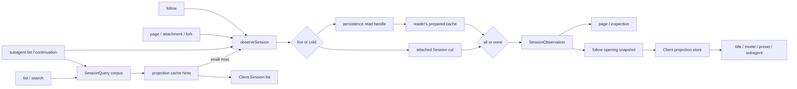

# Agent Note: Session-Observations und projektionsgeführtem Client-State
[English](2026-08-25-session-observations-and-projection-owned-client-state.md) | [中文](2026-08-25-session-observations-and-projection-owned-client-state.zh.md) | Deutsch

Status: implemented

## Problem

Session-nahe consumers benötigten dieselben logischen Daten, lösten sie aber unabhängig voneinander auf. List-, follow-, page-, attachment- und fork-Lesevorgänge sowie die subagent-Inspektion wählten jeweils zwischen einer attached Session, persistierten Metadaten, einer prepared Session und projection-cache-Einträgen. Ein einzelner page-Besuch konnte daher dasselbe kalte Log mehr als einmal materialisieren, und unabhängig zusammengesetzte header-, event-, cursor- und projection-Werte konnten unterschiedliche Schnitte beschreiben.

Auch Client-Features hielten Session-abgeleitete Fakten in mehreren Formen vor. Der Titel hatte eine eigene list- und update-Behandlung; die model selection mischte einen Session-spezifischen Katalog-Request mit lokalem State; die agent-preset-Anzeige konnte einen globalen Default ableiten, bevor die aktuelle Session eintraf; und das subagent-Listing scannte oder rekonstruierte die Identität separat. Diese Spiegel erzeugten Zwischenzustände, in denen die UI einen geratenen Default, eine rohe id oder einen nicht verfügbaren Zustand zeigte, obwohl die durable Session die Antwort bereits festlegte.

Nur den persistence-Lesevorgang zu vereinheitlichen ließe diese Client-Spiegel als konkurrierende Autoritäten bestehen. Nur die Client-Felder zu vereinheitlichen ließe jeden Host-Endpunkt frei, einen anderen Quell-Schnitt zu beziehen. Die Leseeinheit und die Einheit abgeleiteten States brauchen daher eine gemeinsame Ownership-Regel.

## Entscheidung

Exakte Session-Lesevorgänge nutzen eine retained `SessionObservation`, und replaybare Session-abgeleitete Werte, die dem Client exponiert werden, nutzen registrierte Projektionen. Die Observation besitzt die Quell-Auswahl und einen immutable read cut; die Projektion besitzt die Ableitung aus diesem Schnitt. API-Schichten wählen aus, was publiziert wird, während Client-Code fertige Werte konsumiert und Session-Fakten weder aus events rekonstruiert noch in domänenspezifischen Spiegeln dupliziert.

### Datenfluss

Die beiden Ownership-Regeln treffen am projection snapshot der Observation zusammen. Leichtgewichtiges Listing darf bei gecachten hints stehen bleiben; jedes exakte Öffnen erreicht denselben observation-Pfad und gibt dem Client eine vollständige Ersatz-Baseline.

### Observation ist die Punktlese-Einheit

`SessionQueryEngine.observeSession(sessionId, options)` liefert eine disposable `SessionObservation` mit einer Quell-Art, header, zusammenhängendem event-Präfix, cursor, optionalem projection snapshot und der durable revision einer prepared Quelle. Eine attached Session gewinnt. Andernfalls bedient der eigene prepared cache des readers — auf `stat().revision` gekeyed und durch observation-Leases gepinnt — die kalte Session und teilt einen persistence-Lesevorgang (`open(id, 'read')` + `read`) über nebenläufige Observations, einschließlich eines laufenden kalten Ladevorgangs.

Jeder Owner disposed seine Observation. `retain()` erzeugt ein weiteres Lease über denselben Schnitt, wodurch `session.follow` einen Snapshot publizieren und anschließend genau diese prepared Quelle an die background-Agent-Promotion übergeben kann, ohne das Log erneut zu lesen. Eine live Session, die während der kalten Auflösung erscheint, gewinnt vor der Publikation; eine verschwundene live Quelle wird als kalt erneut versucht.

### Quell-Auflösung und Lebensdauer

Eine Observation bindet alle zurückgegebenen Felder an einen lifecycle-Zeugen. Caller kombinieren keinen header aus dem corpus-Listing mit events aus der persistence und Projektionen aus einer späteren live Session. Der gewählte header und das event-Präfix erzeugen cursor und projection snapshot gemeinsam. Eine live Observation fixiert ihren Schnitt als Log-Länge zum Lesezeitpunkt und materialisiert `events` beim ersten Zugriff; das Log wird nur erweitert, daher ist dieses Präfix identisch, egal wie spät ein consumer es liest, und ein consumer, der nur header, cursor oder Projektionen braucht, kopiert das Log nie.

Die live-Präferenz wird sowohl vor als auch nach einem kalten borrow geprüft. Die zweite Prüfung schließt das race, bei dem ein Agent attached, während die persistence lädt. Meldet die persistence selbst, dass eine live Quelle gewonnen hat, diese Quelle aber bis zur Prüfung durch SessionQuery bereits detached ist, startet die Auflösung neu, statt eine ungeownete Referenz zu publizieren.

Fehlende persistence wird erst dann auf Session-not-found abgebildet, wenn keine attached Session existiert. Durable Korruption, Quell-Identitätskonflikt, Abbruch und operationelle persistence-Fehler bleiben distinkte `SessionQueryError`-Ergebnisse, sodass API-Owner ihr eigenes öffentliches Fehlervokabular bewahren können, ohne die Quell-Erkennung zu duplizieren.

Die Observation besitzt keine Mutationsautorität. Ihr event-Array ist ein immutable-Präfix, und ihre prepared Session bleibt unpubliziert. Promotion ist ein expliziter Ownership-Transfer, den der Session Controller ausführt, nachdem er den opening snapshot emittiert hat; andere readers können eine Observation nicht in einen live Agent verwandeln.

Projektionsarbeit ist bewusst `all | none`. `all` berechnet jede registrierte Projektion am event cursor der Observation; `none` lässt den Projektionszustand unberührt. Es gibt keinen per-key-Vorbereitungszustand, keinen `projectionKeys`-Modus und keine gecachte `viewedState`/`viewedValue`-Schicht. Ein publisher darf die fertigen Werte für ein Publikum filtern, doch die zugrunde liegende Observation wird nie teilweise projiziert.

### Ausführungsgrenze der Projektion

Bei einer live Quelle liest `all` einen synchronen registry-Snapshot. Bei einer prepared Quelle darf der projection cache gültige state rows setzen, danach schreitet jede registrierte Einheit über das exakte verbleibende event-Präfix voran. Die resultierenden Client-Werte teilen ein `asOfSeq`.

Filtern gehört hinter die Berechnung, weil es die Offenlegung ändert, nicht den Zustand. Eine page-Autorisierungsprüfung darf nur `subagent` konsumieren, und eine Listenzeile darf nur listenrelevante Werte publizieren, während beide bei angeforderter Projektionsarbeit weiterhin auf einem vollständig projizierten Schnitt beruhen.

Die registry besitzt den fold state; jede Domäne besitzt ihre `init`-, `apply`-, `view`-, schemas- und `stateVersion`-Werte. SessionQuery weiß nur, ob Projektionsarbeit erforderlich ist. Es kennt keine Semantik von title, model, preset, subagent, token, image, plan, todo oder goal.

`view` bleibt eine ungecachte synchrone Konversion über gefoldetem State. Seine Kosten sind durch die registrierten Projektionseinheiten begrenzt und fallen bei der Snapshot-Publikation an; ein zweiter cache würde Invalidierungszustände hinzufügen, ohne das event-replay zu reduzieren.

Corpus-Listing bleibt eine separate leichtgewichtige Operation. `listSessions()` liefert live-präferierte headers, ohne jedes Log zu materialisieren. Session-Liste und subagent-Liste nutzen zuerst live-Projektionszustand oder durable projection-cache rows. Die Session-Liste darf eine vollständige Observation für ein einzeln gespeichertes Artefakt innerhalb ihres konfigurierten small-log-Limits nehmen, wenn gecachte Metadaten nicht feststellen können, ob es leer ist; ein großer oder unlesbarer cache-Miss bleibt mit unbekannten hints sichtbar.

`session.follow` publiziert einen erforderlichen opening snapshot mit header, cursor, dem initialen event-Fenster und einer vollständigen Projektions-Baseline. Reconnect ersetzt die vorherige Generation durch einen weiteren vollständigen Snapshot. `session.page` ist für Lesevorgänge älterer Historie und gap repair reserviert. Observation-only-Lesevorgänge aktivieren nie einen Agent; nur ein ordentliches follow darf seine prepared Observation behalten und nach Auslieferung des opening snapshots eine Promotion anfordern.

### Lese-Publika

Jede öffentliche Operation wählt eine Abfrage- und Projektions-Policy. Die Wahl ist Teil des Verhaltens dieser Operation, keine Heuristik in persistence oder Transport.

| Operation | Lese-Pfad | Projektions-Policy | Agent-Aktivierung |
|---|---|---|---|
| `session.list` | Corpus-headers, live state und gecachte rows; begrenzter small-log-Fallback | Partielle hints oder eine vollständige small-log-Observation | Nie |
| `session.search` | Corpus-Autorisierung plus der konfigurierte search provider | Keine für das Ergebnis-Listing | Nie |
| `session.follow` | Eine exakte Observation | Alle, im opening snapshot getragen | Nur ordentliche kalte Session, nach Snapshot-Auslieferung |
| `session.page` | Eine exakte Observation | Keine, außer projektionsgestützter subagent-Autorisierung | Nie |
| Attachment- und fork-Quelle | Eine exakte Observation | Keine, sofern die Autorisierung sie nicht erfordert | Nie für die Quelle |
| Subagent-Liste und continuation | Corpus plus live/cache/observation-Auflösung | Alle bei kaltem Fallback; das Publikum konsumiert Identität oder geerbte Werte | Nie für das Listing; die continuation folgt ihrer expliziten Kommando-Semantik |

### Replaybare Client-Fakten sind projektionsgeführt

Ein Client-sichtbarer Fakt gehört zur `SessionProjectionMap`, wenn sein Wert durch den Session-header oder das event-Log bestimmt ist und reload, kalten Zugriff oder reconnect überstehen muss. Die Regel deckt Titel, Listen-Metadaten, model selection, agent-preset-Auswahl, subagent-Identität und subagent-Timing ab. Ihre Domänen-Pakete besitzen reine Projektionsdefinitionen; der Session-Transport und der Client-value-store bleiben domänenneutral.

Die drei Projektions-Auslieferungszustände haben unterschiedliche Bedeutungen:

- Ein Session-Listen-hint ist optional, partiell und möglicherweise stale. Ein fehlender key bedeutet unbekannt, daher darf ein Listen-consumer keinen leeren Wert oder deployment-Default erfinden.
- Eine follow-opening-Baseline ist die vollständige Menge der Client-sichtbaren Projektions-Capabilities, die an ihrem cursor registriert sind. Ein fehlender key dort bedeutet, dass die capability für diese Host-Komposition abwesend ist.
- Ein explizites `null` ist ein domänenberechnetes Kein-Wert-Ergebnis. Es unterscheidet sich von einem fehlenden Listen-hint und übersteht den JSON-Transport.

Diese Unterscheidungen verhindern, dass ein überladenes `undefined` cache-Miss, nicht geladenes plugin und eine echte Domänen-Antwort zugleich darstellt. API-Typen benennen Listen-Daten als hints und opening-Daten als baseline, damit ein consumer nicht allein wegen der Projektionswerte gleiche Vollständigkeit annimmt.

### Client-Merge-Regeln

| Eingabe | Vollständigkeit | Freshness | Bedeutung fehlender key |
|---|---|---|---|
| Session-Listen-hints | Partiell | Letzter durable checkpoint oder begrenzter fallback-Schnitt | Unbekannt |
| Follow-opening-Baseline | Vollständig für die Host-Komposition | Exakter opening cursor | Capability abwesend |
| Projektions-frame | Ein ganzer key | Vom frame getragene event-Sequenz | Nicht anwendbar |

Der Client speichert eine row pro key mit ihrer Sequenznummer. Ein neuerer hint, baseline oder frame ersetzt eine row; eine gleich alte oder ältere Eingabe wird ignoriert. Reconnect kann daher das event-Fenster ersetzen, ohne einen Projektions-frame zurückzurollen, der bereits zu einer späteren Sequenz akzeptiert wurde.

Die Listenansicht liest denselben per-Session-store wie die geöffnete Session. Hints können Titel, preset und andere Listen-Darstellung befüllen, bevor follow abschließt; die opening baseline konvergiert diesen Zustand dann, ohne eine zweite Nur-Zusammenfassungs-Autorität zu schaffen.

Der per-Session-Client-projection-store akzeptiert Listen-hints, die follow-Baseline und spätere Ganze-Wert-frames unter einer higher-sequence-wins-Regel. Er foldet nie Session-events. Eine baseline oder ein frame darf einen gehinteten Wert voranbringen, während ein älterer Schnitt eine neuere row nicht überschreiben kann.

Daten, die nicht von einer Session abgeleitet sind, bleiben außerhalb der Projektionen. `session/modelCatalog` besitzt den Host-Generations-Modellkatalog, und `agentPresets/list` besitzt die konfigurierbare preset-Liste. Ein Selector kombiniert den relevanten Katalog mit der `modelSelection`- oder `agentPreset`-Projektion der Session erst, wenn beide Eingaben bereit sind. Während eines refresh darf er den letzten vollständigen Katalog behalten; vor dem ersten vollständigen Paar meldet er loading, statt einen geratenen Namen oder ein vermutetes Verfügbarkeitsurteil zu rendern.

Client-lokaler Interaktionszustand bleibt ebenfalls lokal: loading- und error-Status, ein offenes Menü, eine laufende Auswahl und eine vorgemerkte Wahl für eine noch nicht erzeugte Session sind keine replaybaren Session-Fakten. Sobald eine Wahl auf eine Session angewendet wird, werden ihr durable event und ihre Projektion maßgeblich.

### Domänen-Anwendungen

- **Titel und Listen-Metadaten.** Gecachte Projektions-hints dürfen einen bestehenden Titel rendern und Leerheit oder Aktualität bestimmen. Fehlende hints lassen diese Fakten unbekannt; nur die begrenzte small-log-Policy darf sie während des Listings auflösen.
- **Model selection.** `model/selection` zeichnet eine vollständige provider-, model- und optionale reasoning-effort-Auswahl auf. `modelSelection` unterscheidet die Route des letzten Requests von einer späteren Auswahl, die noch auf Konsum durch einen Request-header wartet.
- **Agent preset.** Die Projektion initialisiert aus immutablen Session-Metadaten und schreitet bei preset-selection-events voran. Ein fehlender oder `null`-Wert wird für eine bestehende Session nicht durch den deployment-Default ersetzt.
- **Subagent-Identität.** Die `subagent`-Einheit bleibt der alleinige descriptor-Interpreter. Das Listing bezieht Kandidaten aus dem gemeinsamen corpus und löst Werte über live state, projection cache oder eine Observation auf, statt events selbst zu scannen.
- **Subagent-Darstellung.** Opening-Projektionswerte etablieren Timing und Identität, bevor der Client das Kind als interaktiv oder offline deklariert, sodass Transport-loading keine durable state vortäuscht.

Diese Migrationen entfernen Client-Sonderfall-State, ohne die Projektion provider-Kataloge oder Interaktionsmechanik besitzen zu lassen. Eine Domäne besitzt weiterhin Mutationen und Kommandos; die Projektion besitzt nur ihr replaybares Session-Ergebnis.

### Fehler- und readiness-Grenzen

- Ein Listen-cache-Miss ist kein Fehler und verbirgt die row nicht. Unbekannte hints bleiben abwesend, bis ein begrenzter fallback oder ein exaktes Öffnen sie liefert.
- Ein Projektionsfehler während einer exakten kalten Observation lässt diese Observation als korrupte Session-Daten fehlschlagen; caller publizieren keine Mischung erfolgreicher und fehlgeschlagener keys.
- Die fehlgeschlagene kalte Observation eines subagent-Kandidaten ist auf die Diagnose-row dieses Kandidaten isoliert; Geschwisterkandidaten bleiben nutzbar.
- Ein Katalog-Ladefehler ist Client-sichtbarer Katalogzustand. Er löscht während eines refresh keinen zuvor vollständigen Katalog und synthetisiert keine Session-Auswahl.
- Eine follow-carrier-Generation wird erst akzeptiert, wenn ihr opening snapshot validiert und angewendet wurde. Die vorherige Generation bleibt während des reconnect sichtbar.

Abbruch stoppt wartende oder laufende kalte Auflösung an dokumentierten checkpoints und gibt jedes erworbene Lease frei. Abbruch wird nicht in not-found umgewandelt und darf keinen prepared-Eintrag gepinnt zurücklassen.

### Ownership-Matrix

| Belang | Owner | Nicht-Owner |
|---|---|---|
| Kalte Materialisierung und revisions-Prüfungen | Session persistence | API Controller und Client |
| Exakter live-präferierter read cut | SessionQuery-Observation | Einzelne Endpunkt-Helfer |
| Fold state und Client-Wert-Berechnung | Projektions-registry und Domänen-Einheit | SessionQuery und Client |
| Partielle Listen-Beschleunigung | Projektions-cache und Listen-Policy | Follow-Protokoll |
| Opening- und reconnect-Ersatz | Session follow und journal stream | Session page |
| Per-key-Wert-Ordnung | Client projection store | Domänen-UI-Komponenten |
| Provider- oder preset-Katalog-Lifecycle | Sein Katalog-directory | Session-Projektion |
| Rendering und transienter Interaktionszustand | Domänen-UI-Paket | Host-Projektionseinheiten |

### Erweiterungsregeln

1. Feststellen, ob ein neuer Wert ein replaybarer Fakt einer Session ist. Falls ja, seine durable header/event-Eingabe definieren oder wiederverwenden, bevor ein Client-Feld hinzukommt.
2. Eine reine Projektionseinheit in der besitzenden Domäne registrieren. Fold state und Client-view-Typen getrennt halten, wenn ihre Repräsentationen abweichen.
3. Exakte readers `projectionMode: 'all'` anfordern lassen; nur beim Aufbau einer publikumsspezifischen Antwort filtern.
4. Listen-consumer einen optionalen hint akzeptieren lassen. Keine vollständige corpus-Hydration erzwingen, nur um einen expliziten unbekannten Zustand zu vermeiden.
5. Den generischen Client-projection-store füttern. Für denselben Fakt keinen dedizierten reconnect-fetch, event-reducer oder Session-summary-Spiegel hinzufügen.
6. Nicht-Session-Kataloge und ephemeren UI-State in ihren eigenen Ownern belassen und readiness definieren, bevor sie mit einem Projektionswert kombiniert werden.

Diese Regeln gelten für neuen Session-abgeleiteten Client-State selbst dann, wenn ein direkter event-Scan billig erscheint. Komplexität wird über kalte Lesevorgänge, reconnect, mehrere Tabs, plugin-Lifetime und künftige consumer hinweg gemessen, nicht an der ersten Aufrufstelle.

### Verhältnis zu bestehenden Entscheidungen

- [Reusable Session preparation](../../archived/architecture/2026-08-05-session-preparation.md) besitzt kalte Materialisierung, repair, reservation und Publikation. Observation fügt ein gemeinsames Lese-Lease über diesem prepared Objekt hinzu; sie verlagert die preparation nicht in SessionQuery.
- [Session history and Remote event transport](2026-08-18-session-history-and-event-transport.de.md) besitzt stream-Generationen und Ersatz-Semantik. Diese Entscheidung liefert den exakten Snapshot, der jede journal-Generation eröffnet.
- [Projection state and Client views](../../archived/architecture/2026-08-19-session-projection-state-and-client-views.md) besitzt die Unterscheidung zwischen Host-fold-state und Client-Werten. Diese Entscheidung regelt, wo diese Werte konsumiert werden und wie sich partielle Listen-hints von einer vollständigen baseline unterscheiden.
- [Subagent identity projection](../../archived/architecture/2026-08-06-subagent-list-identity-projection.md) besitzt weiterhin das descriptor-folding, die serialisierbare `null`-Sentinel und die own-suffix-Sequenzprüfung. Diese Entscheidung ersetzt nur ihren unabhängigen corpus-merge und den direkten kalten Inspektionspfad: das Listing nutzt nun SessionQuerys corpus und Observation.
- Der weitergehende [session projection and command log proposal](../../proposed/architecture/2026-07-27-session-projection-and-command-log.de.md) bleibt für die Teile proposed, die nicht durch ausgelieferten Code abgedeckt sind. Diese Entscheidung protokolliert die ausgelieferte Teilmenge aus Observation und Client-Ownership.

## Verifikation

Persistence- und SessionQuery-Tests pinnen gemeinsames kaltes Laden, Abbruch, live-Quell-races, retained Observations, disposal und all-or-none-Projektionsberechnung. Session-Controller- und Gateway-Tests pinnen snapshot-first-opening, Ersatz-reconnect, ältere page-Lesevorgänge, gap repair, Listen-cache-hints, begrenzten small-log-Fallback und Promotion nach Snapshot-Auslieferung.

Client-Tests pinnen higher-sequence-wins-Projektionsspeicherung, Titel-Updates, Modellkatalog- und Auswahl-readiness, preset-Listen-refresh und Session-spezifische Auswahl sowie subagent-loading ohne transient offline wirkende Darstellung. Subagent-Tests pinnen corpus-Enumeration, cache- und observation-Fallback, lifecycle-Zeugen, begrenzte kalte Lesevorgänge und keine Agent-Aktivierung während des Listings.

## Erwogene Alternativen

**Quell-Auflösung in jedem consumer belassen.** Abgelehnt, weil jeder caller weiterhin sein eigenes live race, persistence-Fehler-Mapping, preparation-Lifetime, Abbruch und Projektionsschnitt implementieren würde, was sowohl doppelte Arbeit als auch inkonsistente Ergebnisse erlaubt.

**Für jeden exakten Lesevorgang einen Agent aktivieren.** Abgelehnt, weil list, history, attachment, search und subagent-Inspektion Lese-Operationen sind. Aktivierung lädt plugins und ändert Prozesszustand, und sie hat keinen natürlichen Rückzugspunkt für Paginierungs- oder Katalog-Lesevorgänge.

**Nur angeforderte Projektions-keys vorbereiten.** Abgelehnt, weil eine teilweise projizierte Session einen weiteren lifecycle-Zustand erzeugt, den jeder cache-, restore-, plugin-Registrierungs- und caller-Pfad verfolgen muss. Projektionseinheiten sind rein und wenige; alle registrierten Einheiten für eine exakte Observation zu berechnen ist einfacher als `O(E*k)`-Teilzustand statt `O(E*P)`-Gesamtzustand zu pflegen.

## Konsequenzen

Session-Verbraucher teilen sich ein live-präferiertes Read-Modell und ein vorbereitetes kaltes Objekt. Header, Events, Cursor und Projektionen gehören zur selben Observation, und das gewöhnliche Öffnen einer Seite kann dieses Objekt für spätere Promotion wiederverwenden. Neue Point-Read-Verbraucher verwenden SessionQuery, statt Persistence- und Registry-Aufrufe selbst zu komponieren.

Session-abgeleiteter Client-Zustand hat einen Erweiterungspfad: das dauerhafte Eingabe dokumentieren oder identifizieren, eine reine Projektionseinheit registrieren und ihren fertigen Wert über den generischen Store verbrauchen. Domänenspezifische Kataloge können separat bleiben, wenn sie nicht Session-abgeleitet sind, aber sie können keinen Default für eine unbekannte Session-Projektion ersetzen.
