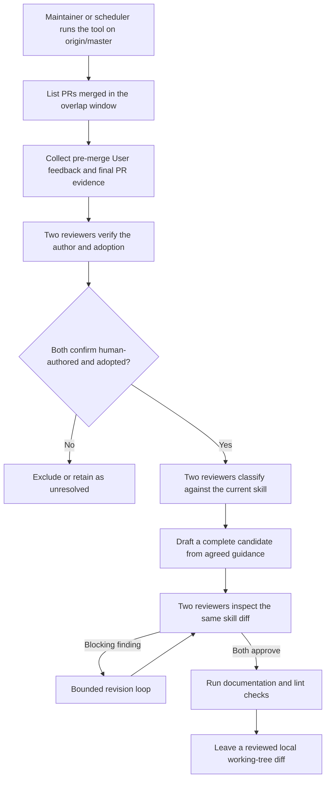

# Agent Note: Periodische Human-Review-Wartung für dsh-code-review

Status: proposed

[English](2026-07-13-human-review-skill-maintenance.md) | [中文](2026-07-13-human-review-skill-maintenance.zh.md) | Deutsch

## Problem

Der `dsh-code-review`-Skill protokolliert Fehlmuster, die Reviewer-Urteil erfordern, aber Einmal-Audits sind teuer zu wiederholen und leicht in inkonsistenter Scope zu fassen. Jede Kommentar als Lektion zu behandeln erzeugt Checklist-Bloat; Merge, Thread-Auflösung oder eine „fixed"-Antwort des Autors als Beweis für Adoption zu behandeln, fördert Feedback, das der finale Code möglicherweise nicht umsetzt. Der Wartungsprozess braucht genügend Evidenz und unabhängige Review, um fail-closed zu sein, ohne vor dem Nachweis der Nützlichkeit des Workflows einen Webhook-Service, dauerhaften Event-State oder automatische Repository-Promotion zu erfordern.

## Vorschlag

Periodische Wartung außerhalb des Repositories. Ein privates Tool, das auf der Maschine des Skill-Warters aufbewahrt wird statt in diesem Repository eingecheckt zu sein, läuft gegen eine saubere Vollhistorie-Checkout auf aktuellem `origin/master`. Der vorgesehene Scheduler läuft täglich mit einem zwei-UTC-Tage-Überlapp; manuelle Läufe akzeptieren eine andere `--since`-Dauer oder wiederholte `--pr`-Argumente für eine explizite Menge. Der Scan ist idempotent gegenüber dem aktuellen Skill und speichert keinen Repository-Cursor. Die einzige Repository-Datei, die durch Promotion geändert wird, ist [.agents/skills/dsh-code-review/SKILL.md](../../../skills/dsh-code-review/SKILL.md); der Draft-PR listet die Quell-Feedback-URLs oder -IDs und die Adoption-Evidenz auf, ohne die privaten Adapter-Logs preiszugeben.

### Erwerbsvertrag

Jeder ausgewählte PR wird vor der Abholung jeglichen Feedbacks gefiltert: sein Merge-Commit muss ein Vorfahre von `origin/master` sein. Merge-Commit-Erreichbarkeit ist der einzige Qualifikationstest — ein gestackter PR, dessen direktes Base ein Feature-Branch ist, wird zugelassen, sobald das Base nachträglich master erreicht hat, weil der Code, den der Reviewer kommentiert hat, nun auf master ist, unabhängig vom Zwischen-Stack. Das Tool löst auch den Ziel-Elternteil des Landing-Merges auf; eine Landing-Form, die es nicht rekonstruieren kann, wird in `skipped-pulls.json` protokolliert und übersprungen. Ein einzelner PR, der Preflight, Erwerb oder Evidenzerfassung fehlschlägt, wird übersprungen, statt den gesamten Lauf abzubrechen. Die Suchstufe schlägt laut fehl, wenn das Fenster die GitHub-Suchgrenze von 1.000 Ergebnissen überschreiten würde, damit kein gemergter PR stillschweigend ausgelassen wird. Die Erwerbsstufe liest vollständige paginierte Verbindungen für Inline-Review-Kommentare, Review-Einreichungen und PR-Commits. PR-Gesprächskommentare werden nicht erworben, weil der aktuelle GitHub-Zustand nicht nachweisen kann, welcher überlebende Commit sie nach einem Force-Push voranging, sodass der Erwerbsvertrag sie bedingungslos ausschließen würde. Der Workflow akzeptiert erworbenes Feedback nur, wenn GitHub den Actor-`type` als `User` meldet, und nur, wenn sowohl Erstellungs- als auch letzter-Bearbeitungszeitstempel strikt vor dem PR-Merge liegen (eine gleichzeitige Bearbeitung wird als post-merge behandelt); Review-Einreichungen verwenden GraphQL `lastEditedAt`, weil die REST-Darstellung die Bearbeitungszeit weglässt.

### Adoption-Evidenz

Jeder Feedback-Eintrag trägt eine stabile Quell-ID und begrenzte Änderungsevidenz. Wenn die `commit_id` des Reviewers noch zum PR gehört (Force-Push fail-closed), wählt das Tool den letzten PR-Commit, dessen Committer-Zeitstempel strikt vor dem Feedback liegt, als Baseline — nicht den vom Reviewer angeklickten Commit, der ein älterer Commit sein kann. Es vergleicht diese Baseline nie direkt mit dem Landing-Merge: ein solches Diff enthält unverwandte Änderungen aus einem voranschreitenden Ziel-Branch. Stattdessen gibt es den Adoption-Reviewern zwei PR-spezifische Patch-Snapshots. Sei `B` die Feedback-Baseline, `T` der Ziel-Elternteil des Landing-Merges und `M` der Landing-Merge. Der Feedback-Zeitpunkt-Snapshot ist der Tree-Diff von `merge-base(B, T)` nach `B`; der finale Snapshot ist der Tree-Diff von `T` nach `M`. Eine nur-Ziel-Änderung erscheint daher in keinem PR-Patch, während eine nach dem Feedback zum PR hinzugefügte Änderung nur im finalen Snapshot erscheint. Force-gepushte Reviews, Feedback, das jedem überlebenden PR-Commit vorangeht, und Landing-Formen, deren Ziel-Elternteil nicht rekonstruiert werden kann, werden deterministisch als `unclear` klassifiziert, bevor ein Reviewer sie sieht. Merge-Status, ein aufgelöster Thread, eine „fixed"-Antwort des Autors oder eine gleiche-Datei-Bearbeitung ist Kontext, nicht Adoption-Beweis; die eigenen Kommentare des PR-Autors erreichen den Adapter nie, da sie keine Adoption ihrer selbst sein können.

### Dual-Reviewer-Klassifikation und Entwurf

Zwei unabhängig konfigurierte Reviewer-Adapter klassifizieren, wer jeden qualifizierten Eintrag verfasst hat (`human-authored`, `forwarded-automation` oder `unclear`) und ob die Änderung ihn übernommen hat (`adopted`, `rejected` oder `unclear`). Nur übereinstimmende `human-authored` plus `adopted`-Urteile gehen weiter. Die übernommene Menge erhält dann eine zweite unabhängige Klassifikation gegenüber dem aktuellen Skill: Kandidat, bereits abgedeckt, implementierungsspezifisch oder kein Feedback. Ein Singleton kann qualifiziert sein; Wiederholung ist nicht erforderlich. Uneinigkeit erhält eine begrenzte Neubewertung und bleibt in Lauf-Artefakten sichtbar, wenn ungelöst. Ein einzelner Batch, dessen Adapter-Output die Schema- oder ID-Validierung fehlschlägt, wird auf Batch-Ebene fail-closed behandelt — jeder Feedback-Eintrag darin wird als unclear markiert und nach `excluded` geleitet — statt den gesamten Lauf abzubrechen; der fehlerhafte rohe Output wird unter den privaten Lauf-Artefakten zur Fehlersuche aufbewahrt. Wenn ein Adapter für einen nicht-leeren Batch in einer Operation kein gültiges Ergebnis zurückgibt, beendet der Lauf mit Nicht-Null und emittiert einen Fehlereintrag statt „kein Kandidat" zu melden.

Der primäre Adapter entwirft aus strukturierten, vereinbarten Richtlinien, nie aus rohem Review-Text. Er bleibt gemäß Adapter-Autoren-Vertrag tool-frei und read-only: Er gibt vollständige Kandidat-Dateiinhalte zurück, die das Tool validiert, bevor es das einzige Ziel schreibt. Beide Adapter reviewen dann denselben vollständigen Skill-Diff; blockierende Befunde kehren in einen begrenzten Revisions-Loop zurück, und beide müssen dieselbe Revision genehmigen. Das Tool lehnt gestagte Änderungen und Bearbeitungen außerhalb des Ziel-Skills sowohl vor der Ausführung der Dokumentations- und Lint-Gates als auch erneut vor dem Erfolgsmeldungsbericht ab, damit ein Gate oder ein paralleler Prozess, der einen anderen Pfad hinzufügt, nicht durchrutschen kann. Bei Fehlschlag stellt es seine eigene Schreiboperation mit best-effort Compare-and-Swap wieder her, damit eine parallele Warte-Bearbeitung nicht überschrieben wird. Bei Erfolg speichert es ein Kandidaten-Bundle, das den Quell-`origin/master`-Commit, die Quell-Skill-Blob-ID, den reviewten Diff, den vollständigen Kandidaten, die Quell-Feedback-IDs und -URLs, die Landing-Evidenz- Bereiche, die Adapter-Urteile und die Gate-Ergebnisse enthält; es committet, pusht, öffnet oder mergt nie einen PR.

### Reviewer-Adapter-Protokoll

Jede private ausführbare Datei erhält eine byte-begrenzte, versionierte JSON-Anforderung auf stdin und gibt eine byte-begrenzte, schema-konforme JSON auf stdout zurück. Das Tool verweigert die Ausführung, wenn die beiden Reviewer-Befehle auf byte-identische ausführbare Dateien auflösen — ein Minimum-Standard-Mechanik-Check; die Garantie, dass primär und sekundär von unabhängigen Providern oder Modellen getragen werden, ist die Verantwortung des Deployment-Betreibers. Die `access`- und `tools`-Felder sind Vertragsmarker für den Adapter-Autor, kein OS-Sandbox: Reviewer-Subprocesses werden mit einer gesäuberten Umgebung gespawnt, `cwd` auf ein privates Lauf-Verzeichnis statt auf die Repository-Root gesetzt, und Feedback in einem nonce-beschrifteten `<untrusted-feedback nonce="…">`-Block verpackt, den jeder Prompt als Daten behandelt; der 128-Bit-Nonce verhindert, dass ein nicht-vertrauenswürdiger Body das schließende Tag fälscht. Jeder Subprozess verwendet begrenzte, abbruch-bewusste Prozessbaum-Bereinigung. Adapter-Autoren implementieren jede Operation als reine read-only Inferenz — selbst die `edit`-Operation gibt vollständige Kandidateninhalte in JSON zurück, die das Tool validiert und auf das einzige Ziel schreibt. Jede Produktions-`git`/`gh`/Gate-Spawn verwendet auch die gesäuberte Umgebung, damit die Routing-Variablen eines Pre-Push-Hooks den Warten nicht stillschweigend umleiten können. Kandidaten-Schreiboperationen und der Fehlschlag-Rollback verwenden best-effort Compare-and-Swap gegen den zuletzt geschriebenen Inhalt; der Rollback unstages das Ziel auch, damit ein von Adapter- oder Gate-gestagter Kandidat nicht einen fehlgeschlagenen Lauf in einen späteren Commit überlebt.

### Promotionsvertrag

Der Promote-Helper startet von einer sauberen Checkout auf aktuellem `origin/master` und verweigert die Anwendung eines Kandidaten, wenn der aktuelle Skill-Blob vom im Bundle protokollierten Quell-Blob abweicht. Der Betreiber führt dann die Wartungsanalyse erneut aus oder rebaset den Diff manuell und wiederholt die Kandidaten-Review; der Helper ersetzt nie eine neuere `SKILL.md` mit veraltetem Voll-Datei-Output. Nach der Anwendung eines aktuellen Kandidaten öffnet er einen Draft-PR, dessen Body die Quell-Feedback-URLs oder -IDs, den als Adoption-Evidenz verwendeten Landing-Commit-Bereich, den ursprünglichen Lauf, die Gate-Ergebnisse und jegliche Betreiber-Bearbeitungen auflistet. Rohe Adapter-Prompts und -Antworten bleiben privat, aber Repository-Reviewer erhalten diese konkreten Eingaben, damit sie beurteilen können, ob jede vorgeschlagene Regel aus übernommener menschlicher Feedback folgt.

### Standort des Mechanismus

Der Tool-Quellcode, die Adapter-Binaries, die Provider-Credentials und der vorgesehene tägliche Scheduler werden privat auf der Maschine des Warters aufbewahrt, statt in diesem Repository eingecheckt zu sein. Dieses Dokument speifiziert das Protokoll; die Referenzimplementierung ist private Infrastruktur. Der Mechanismus dient einem einzigen Skill, der von einem einzelnen Betreiber gewartet wird, daher übersteigt die laufende Kosten der Prüfung von Mechanismus-Änderungen durch Repository-Review den Nutzen, das Tool und seine Geschichte einzuchecken. Wenn der Mechanismus jemals einem zweiten Warten übergeben wird, ist diese Übergabe eine Folge-Agent-Note, die diese Entscheidung revidiert — das Betreiber-Dokument unter [docs/cookbook/maintaining-dsh-code-review.md](../../../../docs/cookbook/maintaining-dsh-code-review.md) ist der Einstiegspunkt für jeden Übernehmenden.

## In Erwägung gezogene Alternativen

- **Das Tool in diesem Repository ausliefern.** Für einen einzelnen Warten abgelehnt: Repository-Wartungs-Overhead (Typecheck, Lint, Coverage, Querschnitts-Refaktorisierungen) würde den Wert eingecheckten Quellcodes und Review-Historie übersteigen. Behaltene Option für eine spätere Übergabe.
- **Jeden Feedback-Zeitpunkt-PR-Head protokollieren** — abgelehnt: Es verbessert die kausale Isolation, erfordert aber einen kontinuierlich laufenden Beobachter, dauerhaften Event-State, Retries und Force-Push-Vermittlung. Periodische Wartung verwendet wo verfügbar Review-Commit-Evidenz und schlägt fail-closed bei breiterer Ganz-PR-Evidenz fehl.
- **Einen verarbeiteten-PR-Cursor persistieren** — abgelehnt: Ein überlappendes Zeitfenster-Scanning ist günstig und natürlich idempotent gegenüber dem aktuellen Skill, während Cursor-State Wiederherstellungs- und verpasste-Event-Probleme erzeugt.
- **Bei jedem neuen Kommentar ausführen** — abgelehnt: Review-Wellen erzeugen viele verwandte Kommentare und fehlen dem finalen Artefakt, das zur Beurteilung der Adoption benötigt wird.
- **Merge oder Thread-Auflösung als Adoption behandeln** — abgelehnt: Ein PR kann mit abgelehntem, ersetztem oder bewusst ungelöstem Feedback mergen.
- **Repository-Änderungen automatisch erstellen oder mergen** — abgelehnt: Das Tool braucht zuerst eine Erfolgsbilanz nützlicher periodischer Ausgabe. Der Warten inspiziert und fördert den lokalen Diff durch normale Repository-Review.
- **Von korrigierten Bot-Befunden lernen** — abgelehnt: Der Quellvertrag ist menschliches Review-Feedback. Der Autortyp wird vor der Analyse gefiltert, und menschliche Konten, die automatisierte Befunde weiterleiten, werden durch den Autor-Check ausgeschlossen.
- **Einen Reviewer als Autor und Endrichter verwenden** — abgelehnt: Unabhängige Urteile entlarven ungestützte Verallgemeinerung, bevor sie den Skill erreichen.

## Akzeptanzkriterien

Promotion von `proposed/` nach `implemented/` erfordert, dass alle folgenden in einem echten End-to-End-Lauf gegen dieses Repository beobachtet werden:

- Das private Tool läuft von einer sauberen detached Checkout auf aktuellem `origin/master` und meldet entweder „kein Kandidat" oder erzeugt einen Working-Tree-Diff, begrenzt auf `.agents/skills/dsh-code-review/SKILL.md`. **Beobachtet am 2026-07-15:** 62 gemergte PRs gescannt, 5 übersprungen (unerreichbarer Merge-Commit oder >250-Commit-Erwerbsgrenze), 426 menschliche Feedback-Einträge berücksichtigt, 0 Kandidaten hervorgekommen.
- Beide Reviewer-Adapter sind unabhängig konfiguriert (unterschiedliche Provider oder Modelle) und vollenden einen analyze / adopt / review-Durchgang ohne Benutzerintervention. **Beobachtet am 2026-07-15:** unterschiedliche primäre/sekundäre Adapter vollendeten Adoption + Analyse in ~8 Minuten; Batch-fail-closed behandelte eine Adapter-ID-Halluzination, ohne den Lauf abzubrechen.
- Ein Scheduler löst das Tool ohne interaktives Terminal aus, und ein Kandidaten-Diff (oder ein „kein Kandidat"-Eintrag) erreicht den Betreiber über einen dauerhaften Benachrichtigungskanal.
- Ein kontrollierter Erwerbsfall bringt den Ziel-Branch mit einer feedback-konformen Änderung nach der Feedback-Baseline voran; die Reviewer-Evidenz schließt diese nur-Ziel-Änderung aus, während sie eine spätere PR-eigene Änderung beibehält.
- Der Promote-Helper lehnt einen Kandidaten ab, nachdem sich der Quell-Skill geändert hat, und ein aktueller Kandidat öffnet einen Draft-PR mit den oben definierten Quell-Feedback-IDs, dem übernommenen Commit-Bereich, dem ursprünglichen Lauf, den Checks und den Betreiber-Bearbeitungen.
- Mindestens ein von diesem Workflow erzeugter Kandidaten-Diff wird vom Betreiber inspiziert und durch normale Repository-PR-Review nach `master` gefördert. Dieser PR ist der Beweis, dass der Workflow übernommenes Feedback in ausgelieferte Skill-Richtlinien umwandeln kann.

## Risiken

- **Kausalität aus Committer-Zeitstempeln abgeleitet.** Die Feedback-Commit-Baseline wird durch Vergleich von GitHub-Commit-Zeitstempeln mit Feedback-Erstellungszeitstempeln ausgewählt; Committer-Uhrabweichung und Rewrites lassen immer noch ein residuales False-Adoption-Fenster. Die Abgleichung mit dem GitHub-PR-Eventstrom würde dies verschärfen, erfordert aber Event-Erwerb über den Umfang des periodischen Tools hinaus.
- **Zwei Nicht-Kandidaten-Klassifikationen werden ohne Streit-Runde nach `excluded` geleitet.** Wenn beide Klassifizierer „kein Kandidat" sagen, sich aber über den anwendbaren Nicht-Kandidaten-Grund nicht einig sind (zum Beispiel `covered` vs. `specific`), wird der Eintrag ausgeschlossen, statt neu bewertet. Beide Klassifizierer stimmen überein, dass der Eintrag kein neues Reviewer-Verhalten wird, daher würde eine Streit-Runde das Ergebnis nicht ändern.
- **Dual-Reviewer-Unabhängigkeit über Byte-Hash-Unterschiedlichkeit hinaus ist ein Deployments-Vertrag.** Das Tool verweigert die Ausführung, wenn die beiden Befehle auf byte-identische ausführbare Dateien auflösen, kann aber nicht verifizieren, dass zwei unterschiedliche Wrapper unterschiedliche Provider oder Modelle tragen. Betreiber müssen unabhängige primäre und sekundäre Adapter konfigurieren.
- **Best-effort Compare-and-Swap für Kandidaten-Schreiboperationen und Rollback.** Dateibasierter CAS auf POSIX ist nicht wirklich atomar; das Fenster ist ein Event-Loop-Tick. Das Tool zielt auf Single-User-Periodische-Wartung ab, und ein wirklich paralleler Editor liegt außerhalb des Umfangs.
- **Single-Warten-Bus-Faktor.** Da der Mechanismus auf einer Maschine lebt, unterbricht sein Ausfall die Skill-Wartung vollständig, bis der Betreiber den Service wiederherstellt oder ihn durch eine Folge-Agent-Note einem neuen Warten übergibt.
