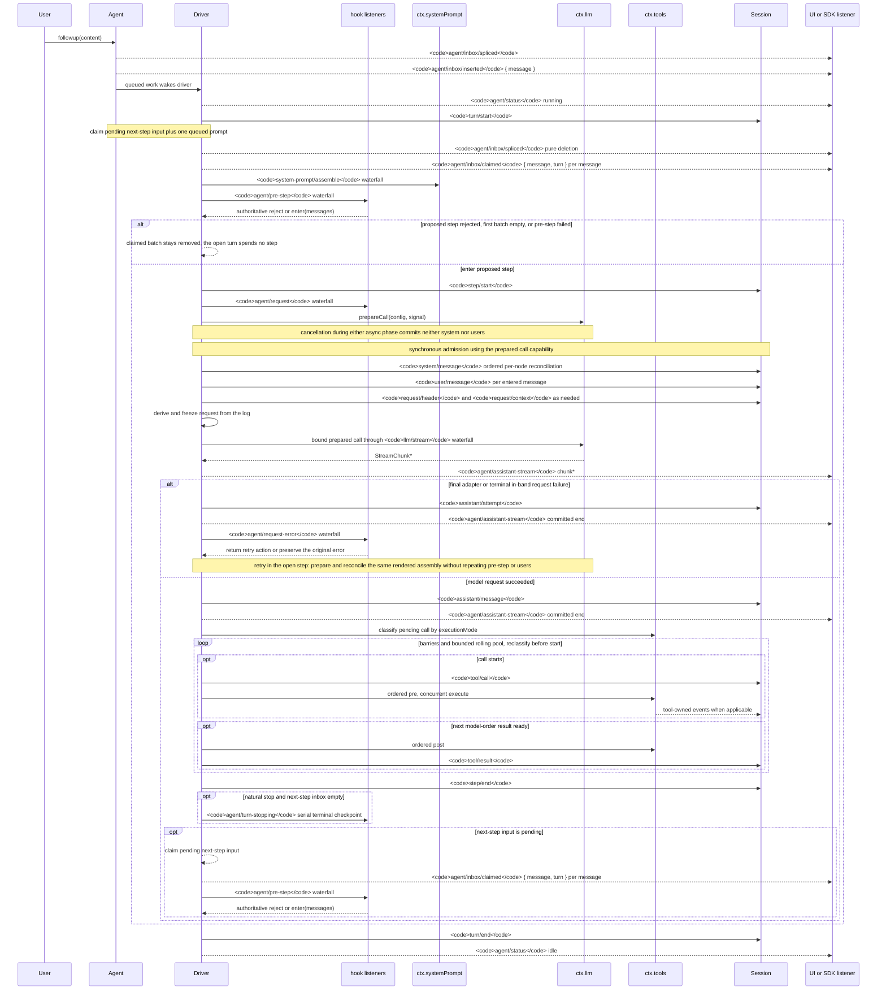

<!-- Die englische Quelldatei wird von scripts/gen-doc-graphs.ts generiert; diese deutsche Datei ist die über den zweisprachigen Paarungsprozess gepflegte begutachtete Gegenseite.
     Zum Aktualisieren zuerst `pnpm run gen-doc-graphs` für die englische Seite ausführen, dann diese Datei aktualisieren und `pnpm run verify-translation-pairing --write docs/agent-lifecycle.md` zur erneuten Paaraufzeichnung ausführen. -->

# Agent-Turn- und Step-Lebenszyklus
[English](agent-lifecycle.md) | [中文](agent-lifecycle.zh.md) | Deutsch

Diese Sequenz ist die visuelle Begleitung zu [architecture.md](architecture.de.md#turn-flow). Sie hält dauerhafte Replay-Fakten auf `session/event` und Live-Steuerung/Status auf `agent/*`.

Das `assistant/message`-Event zeichnet jeden erfolgreichen Provider-Aufruf auf, einschließlich inhaltsloser und `max-tokens`-Abschlüsse, und bettet den exakten kompakten zeitgestempelten Stream ein. Leere Inhalte bleiben aus der abgeleiteten Historie heraus. Ein fehlgeschlagener, wiederholter, abgebrochener oder stream-error-Versuch, der ohne Surface-Message zur Ruhe kommt, zeichnet seinen Stream als `assistant/attempt` auf. Live-`agent/assistant-stream`-Chunk-Frames sind transient; Replay liest entweder die dauerhafte Settlement, und ein harter Prozessverlust vor der Settlement hinterlässt keinen dauerhaften Attempt-Stream.

`dsh-compaction-basic` nutzt `agent/pre-step` für Druck vor der Request-Ableitung und `agent/request-error` nur für kanonischen Context-Overflow. Sobald einer der Trigger qualifiziert, läuft optionales Tool-Result-Pruning vor der Summary-Auswahl. Recovery läuft innerhalb des offenen Steps und wiederholt nur, wenn Pruning oder Summarization die Surface-Replacement-Generation vorantreibt; andernfalls bleibt der ursprüngliche Request-Fehler maßgeblich. Jeder Retry bereitet seinen Call vor und gleicht die beibehaltene gerenderte Assembly vor der Request-Ableitung ab, ohne Assembly, Pre-Step oder User-Admission zu wiederholen.

Die zurückgegebene `agent/pre-step`-Entscheidung ist maßgeblich; Listener, die `next()` wrappen, erhalten Downstream-Messages und `startsRequestSeries`, sofern die Ersetzung nicht beabsichtigt ist. Steering und injizierter Context durchlaufen denselben Waterfall, nachdem eine spätere Claim-Operation ihren Next-Step-Batch übernimmt.

SDK-Nutzer, die replaybare Transcript-Daten benötigen, sollten `session/event` konsumieren; `agent/*` ist die Live-Koordinations-API für Queue/Status, Prompt-Interception, Request-Konstruktion, Steering, Fortsetzung und Fehler.

Wartungsmodus: kuratierte Mermaid-Sequenz; die exakten Event-Signaturen liegen im generierten Cordis-Katalog. Diese deutsche Datei ist die über den zweisprachigen Paarungsprozess gepflegte begutachtete Gegenseite.
