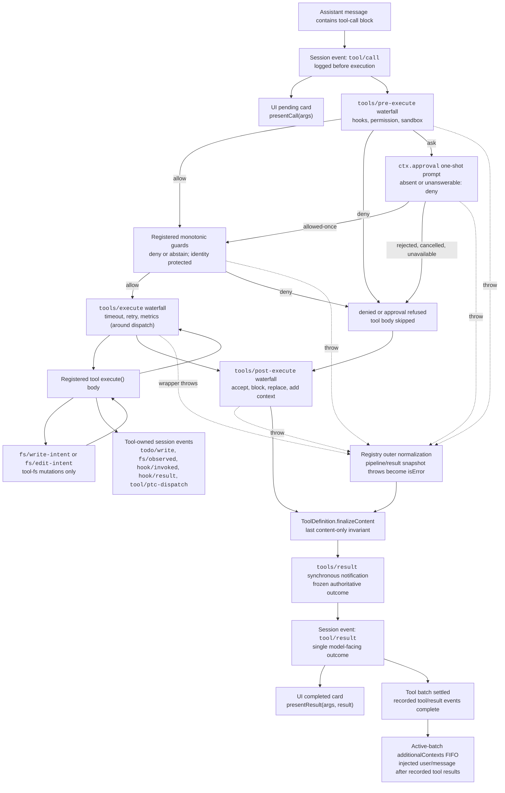

<!-- Die englische Quelldatei wird von scripts/gen-doc-graphs.ts generiert; diese deutsche Datei ist das durch Paarung gepflegte, reviewte Pendant.
     Aktualisieren Sie zuerst die englische Datei mit `pnpm run gen-doc-graphs`, dann diese Datei und `pnpm run verify-translation-pairing --write docs/tool-execution-pipeline.md`, um die Paarung neu aufzuzeichnen. -->

# Tool-Execution-Pipeline
[English](tool-execution-pipeline.md) | [中文](tool-execution-pipeline.zh.md) | Deutsch

Dieser Graph zeigt, wo Policy, Hooks, Sandbox-Isolierung, Filesystem-Guards, Result-Rewriting, Beobachtung des finalen Outcomes und UI-Rendering laufen, ohne den Loop zu verändern. Das `tools/pre-execute`-Waterfall läuft zuerst, danach die monotonen Guards, und die `tools/execute`- und `tools/post-execute`-Waterfälle folgen; die drei Waterfälle können einen Call transformieren. Das Definition-eigene `finalizeContent` und `tools/result` laufen anschließend.

Filesystem-Read-before-Edit-Checks bleiben unterhalb von `tool-fs` auf `fs/*`-Events. Generische Pre-/Post-Waterfälle hosten Hooks und Approval-Policy; `ctx.approval` löst Asks vor den monotonen Guards, und Owner-Policy, die nicht umsortiert werden darf, bleibt ein registrierter Guard. Around-Dispatch-Belange wie Timeouts wrappen `tools/execute`. Die Registry snapshottet verlustfrei das Kandidatenergebnis und normalisiert einen Snapshot-Fehler, bevor der gesnapshottete `finalizeContent`-Callback der sichtbaren Definition sein synchrones Content-only-Invariant erzwingt. `tools/result` beobachtet dann das unveränderliche, verlustfrei-JSON-repräsentierbare Outcome. Das lässt Hooks Tool-Familien überspannen, ohne die Tools an einen Policy-Service zu koppeln. Der PTC-Modus sendet sowohl den reservierten `run_code`-Transport als auch seine serialisierten Sub-Calls durch die Pipeline; Sub-Calls tragen das Parent-Token, loggen `tool/ptc-dispatch`, geben Denials als bindende Rejections zurück und lassen `additionalContexts` weg, um Call/Result-Adjacency zu bewahren.

Maintenance-Modus: kuratierter Mermaid-Flow; exakte Tool-Schemas und Event-Signatures leben in generierten Katalogen.
